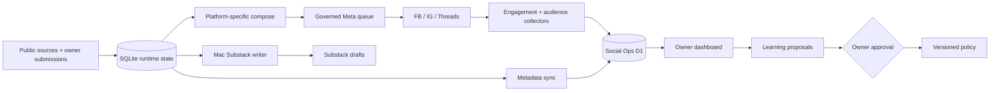

# HsinTiger Social Automation

> **Canonical repository:** `HsinTiger/news-radar`
>
> This is the only repository that owns social scheduling, Meta publishing,
> Substack draft generation, operational state, audience data, and the owner
> dashboard. The repository name remains `news-radar` so the existing GitHub
> Pages URL does not break; the product name is **HsinTiger Social Automation**.

## Current operating state

| Surface | State | Truth boundary |
|---|---|---|
| Meta scheduled publishing | **PAUSED** | Requires an owner-approved canary before `AUTOMATION_MODE=live` |
| Submission processor | **PAUSED** | Submissions may be stored, but the poller will not claim them automatically |
| Meta publish-now | **LOCKED** | Worker returns `409 canary_required` |
| Substack | **DRAFT ONLY** | Never auto-publishes; `draft_created` is reported only after the Mac writes a real draft |
| Social Ops API | **DEPLOYED** | Cloudflare Worker + authenticated D1 |
| Runtime SQLite | **CANONICAL RELEASE STATE** | Versioned GitHub Release bundle, SHA-256 + `PRAGMA quick_check` + readback |
| Dashboard data | **SEEDED** | 29,219 knowledge metadata rows, 807 post records, 381 engagement snapshots |

Owner surfaces:

- [One-off submission](https://hsintiger.github.io/news-radar/substack-submit/)
- [Operational dashboard](https://hsintiger.github.io/news-radar/dashboard/)

The Pages UI is authenticated with an owner token stored only in browser
`sessionStorage`. It never receives a GitHub credential.

## Product contract

### Meta: useful attention, platform by platform

- Facebook, Instagram, and Threads are composed and measured separately.
- Bootstrap cadence is conservative: Threads up to 2/day; Facebook and
  Instagram up to 1/day, with minimum spacing enforced by policy.
- Engagement and audience collectors continue while publishing is paused.
- Frequency or topic changes are proposals. Frequency increases require owner
  approval and sufficient platform-specific evidence.
- A successful workflow is not automatically a successful post. `published`
  means the platform publish path returned success and the result was recorded.

### Substack: high-quality drafts, never auto-publish

- Submitted URLs, text, and YouTube sources enter the canonical runtime DB.
- The Mac worker creates the long-form draft and marks
  `news_items.substack_written_at`.
- Operational sync converts that evidence to `draft_created` in D1.
- The owner reviews and publishes in Substack.

### Governed learning loop

```text
Observe -> Interpret -> Propose -> Owner approve -> Execute -> Verify -> Learn
```

The automation may collect data, generate reversible drafts, and propose
changes without interruption. It may not silently enable live publishing,
increase frequency, or apply learning proposals.

## Architecture



### Durable state

- `scripts/state_store.py` transports SQLite through the
  `runtime-state-v1` GitHub Release.
- Every writer must hold the Release-backed write lease. This serializes Mac
  and GitHub Actions writers, not only Actions jobs.
- The manifest pointer moves only after the uploaded bundle passes hash,
  SQLite, and complete download readback verification.
- Old bundles are retained for rollback.

### Operational data

Cloudflare D1 stores:

- submissions and truthful state transitions;
- per-platform posts and engagement snapshots;
- follower/audience snapshots;
- data-health snapshots;
- knowledge metadata and use counts (not article bodies);
- owner-governed learning proposals and audit events.

## Scheduled jobs

| Workflow | Purpose | Publishing authority |
|---|---|---|
| `adaptive-scheduler.yml` | Evaluates platform cadence and dispatches the main pipeline | Disabled while `AUTOMATION_MODE=paused` |
| `submission-poller.yml` | Claims D1 one-off submissions and dispatches an allowlisted workflow | Disabled while `SUBMISSION_PROCESSOR_MODE=paused` |
| `engagement-monitor.yml` | Polls post metrics every six hours | Read-only platform access |
| `audience-monitor.yml` | Captures daily follower snapshots | Read-only platform access |
| `operational-sync.yml` | Syncs runtime metadata and Substack terminal evidence to D1 | No publishing authority |
| `full_pipeline.yml` | Harvest, compose, publish, verify, feedback, persist | Only dispatched by governed scheduler or owner |
| `reels_publish.yml` | Generates or publishes one idempotent reel | No independent cron; live publish requires owner action |

## One-off submission status contract

```text
queued -> claimed -> dispatched
  Meta:     content_queued -> published
  Substack: source_queued  -> draft_created
  Any path: failed / rejected
```

Transitions are validated server-side. Terminal states are idempotent and
cannot be downgraded. `source_queued` does not mean a Substack draft exists;
`content_queued` does not mean a Meta post exists.

## Mac worker

The Mac compose and fast Substack scripts now use the same Release state and
write lease as GitHub Actions:

```bash
cp scripts/compose_hourly.sh ~/bin/news_radar_compose.sh
cp scripts/drain_substack_fast.sh ~/bin/news_radar_substack_fast.sh
```

The installed launchd copies must be updated on the Mac before Substack draft
status can be considered end-to-end verified. The repository scripts no longer
read or force-push the legacy `state` branch.

## Verification

Local deterministic gates:

```powershell
python -X utf8 -m pytest tests/unit -q
python -m compileall -q src scripts
node --check cloudflare-worker/worker.js
node --check dashboard/app.js
npx wrangler deploy --dry-run
git diff --check
```

Exact gate scope matters: unit tests and Worker smoke tests do not prove a live
Meta publish or a Mac-created Substack draft. Those remain canary gates.

## Repository boundaries

- `HsinTiger/news-radar` — canonical, active automation and owner surfaces.
- `HsinTiger/news-radar-pm` — legacy planning repository; archive after final
  link/dependency audit.
- `HsinTiger/news-radar-dashboard` — legacy dashboard repository; archive after
  the in-repo dashboard is deployed and verified.

See [the rebuild checkpoint](docs/REBUILD_CHECKPOINT_2026-07-23.md) for evidence,
known unknowns, and the owner canary packet.
