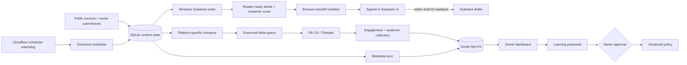

# HsinTiger Social Automation

> **Canonical repository:** `HsinTiger/news-radar`
>
> This is the only repository that owns social scheduling, Meta publishing,
> Substack draft generation, operational state, audience data, and the owner
> dashboard. The repository name remains `news-radar` so the existing GitHub
> Pages URL does not break; the product name is **HsinTiger Social Automation**.

## Current operating state

| Surface | State | Truth boundary |
|---|---|---|
| Meta scheduled publishing | **RECOVERY** | One post/day/platform under source, quality, quota, readback, and shared-lock gates |
| Submission processor | **LIVE** | Poller claims one-off work; target-specific evidence remains required |
| Meta publish-now | **ARMED** | Owner submissions still pass editorial gates before any platform write |
| Substack editorial schedules | **WINDOWS WRITER** | 12:00 Podcast batch and Sunday company article run on the owner Windows host |
| Substack remote draft transport | **BROWSER SESSION ARMED** | The scheduled Codex task uses the signed-in Substack UI, requires an editor draft ID readback, and never exports browser credentials; first unattended run remains pending |
| Substack one-off publish-now | **CANARY PENDING** | Explicit owner choice only; `published` requires post id, public URL, timestamp, and unauthenticated readback |
| Social Ops API | **DEPLOYED** | Cloudflare Worker + authenticated D1 |
| Runtime SQLite | **CANONICAL RELEASE STATE** | Versioned GitHub Release bundle, SHA-256 + `PRAGMA quick_check` + readback |
| Dashboard data | **SEEDED** | 29,219 knowledge metadata rows, 807 post records, 381 engagement snapshots |

Owner surfaces:

- [One-off submission](https://hsintiger.github.io/news-radar/substack-submit/)
- [Operational dashboard](https://hsintiger.github.io/news-radar/dashboard/)

The Pages UI is authenticated with an owner token stored only in browser
`sessionStorage`. It never receives a GitHub credential.

## Product contract

### Meta: useful attention, platform by platform

- Facebook, Instagram, and Threads are composed and measured separately.
- Bootstrap cadence is conservative: Threads up to 2/day; Facebook and
  Instagram up to 1/day, with minimum spacing enforced by policy.
- Engagement and audience collectors continue while publishing is paused.
- Frequency or topic changes are proposals. Frequency increases require owner
  approval and sufficient platform-specific evidence.
- Cadence is evaluated independently for Facebook, Instagram, and Threads over
  adjacent 14-day windows. Both windows must meet the minimum post count, 80%
  metric coverage, and non-zero-signal gates before a change can be proposed.
- A cadence proposal can move only one post/day at a time. The scheduler reads
  only the exact owner-approved runtime override and preserves proposal lineage.
- Deterministic content quality runs per platform. A `rewrite` finding gets one
  composer retry; if it remains, the draft is held for review and cannot enter
  the automatic Meta queue. Historical backfill is evidence-only and never
  retroactively fails or publishes a draft.
- A successful workflow is not automatically a successful post. `published`
  means the platform publish path returned success and the result was recorded.

### Substack: draft-first, with explicit one-off publish-now

- Submitted URLs, text, and YouTube sources enter the canonical runtime DB.
- Planned editorial cadence is one daily **Podcast batch** at 12:00 plus one
  **Weekly** company analysis on Sunday at 09:00. The noon batch refreshes the
  dedicated interview pool and then writes two different, unused interviews
  published within the last seven days. Morning/evening modes remain available
  for deliberate use.
- Each scheduled Podcast draft first extracts the compelling exchange and source
  claims, then reads 5–10 extension sources before the final first-person writer
  call. Podcast targets 4200–6500 Chinese characters; company analysis targets
  3800–6000. Research below five readable sources fails closed. Daily manual
  work targets 1800–2800 characters.
- Deep drafts use distinct evidence angles, an internal claim-to-evidence map,
  and an information-value gate. These compact methods are adapted from pinned
  open-source reviews in Skills Radar; third-party prompt bundles are not loaded
  into the production writer.
- The Windows writer records local/OneDrive completion in
  `news_items.substack_written_at`; the scheduled Codex task then creates remote
  drafts through the already signed-in Substack Browser session. Mac no longer
  owns Substack selection or AI composition.
- Every reader-ready article preserves the actual route/model, clickable public
  sources, the canonical subscription CTA, and a deterministic 瑞瑞/達達
  `cover.png`. Image-search instructions and image-generation prompts are banned.
- API transport still requires a successful Substack `post_draft` response.
  Windows Browser transport instead requires the exact editor URL/draft ID to
  be read back and recorded in the run manifest plus artifact metadata. A local
  article, a clicked Create button, or a Saved label without an ID is not remote
  evidence.
- One-time submissions default to `draft_priority`. The owner may explicitly
  choose `publish_now`; after reader-ready, cover, and audit gates the Mac calls
  `prepublish_draft` and `publish_draft` on that same saved draft ID.
- `published` additionally requires `substack_post_id`, `substack_post_url`,
  `substack_published_at`, and a successful public readback without cookies.
  An ambiguous API result remains `partial` and is never blindly resent.

### Governed learning loop

```text
Observe -> Interpret -> Propose -> Owner approve -> Execute -> Verify -> Learn
```

The automation may collect data, generate reversible drafts, and propose
changes without interruption. It may not silently enable live publishing,
increase frequency, or apply learning proposals.

Topic-weight and per-platform cadence learning are exact-action loops: the reflector records
`field/current_value/proposed_value`; the dashboard records the owner's
decision; `learning-review.yml` applies only an approved action while holding
the canonical Release lease. Identity, current-value drift, range, weekly
delta, compare-and-swap, and post-write readback all fail closed. Approval
authorizes that proposal only; it never grants publishing authority.

## Architecture



### Durable state

- `scripts/state_store.py` transports SQLite through the
  `runtime-state-v1` GitHub Release.
- Every writer must hold the Release-backed write lease. This serializes Mac
  and GitHub Actions writers, not only Actions jobs.
- The manifest pointer moves only after the uploaded bundle passes hash,
  SQLite, and complete download readback verification.
- Old bundles are retained for rollback.

### Operational data

Cloudflare D1 stores:

- submissions and truthful state transitions;
- per-platform posts and engagement snapshots;
- per-platform content-quality summaries without post bodies;
- follower/audience snapshots;
- data-health snapshots;
- knowledge metadata and use counts (not article bodies);
- owner-governed learning proposals and audit events.

## Scheduled jobs

| Workflow | Purpose | Publishing authority |
|---|---|---|
| `adaptive-scheduler.yml` | Evaluates platform cadence and dispatches the main pipeline; receives GitHub cron plus Cloudflare watchdog ticks | Disabled while `AUTOMATION_MODE=paused`; shared lock and quotas prevent duplicate dispatch |
| `submission-poller.yml` | Claims D1 one-off submissions and dispatches an allowlisted workflow | Disabled while `SUBMISSION_PROCESSOR_MODE=paused` |
| `engagement-monitor.yml` | Polls 1h/24h/168h post-age buckets hourly (±45-minute capture window) | Read-only platform access |
| `audience-monitor.yml` | Captures daily follower snapshots | Read-only platform access |
| `operational-sync.yml` | Syncs runtime metadata and Substack terminal evidence to D1 | No publishing authority |
| `learning-review.yml` | Mirrors owner decisions, applies exact approved topic/cadence actions, backfills quality evidence, then creates the next proposals | Policy-write authority only; no publishing |
| `full_pipeline.yml` | Harvest, compose, publish, verify, feedback, persist | Only dispatched by governed scheduler or owner |
| `reels_publish.yml` | Generates or publishes one idempotent reel | No independent cron; live publish requires owner action |

## One-off submission status contract

```text
queued -> claimed -> dispatched
  Meta:     content_queued -> published
  Substack: source_queued  -> draft_created
  Any path: failed / rejected
```

Transitions are validated server-side. Terminal states are idempotent and
cannot be downgraded. `source_queued` does not mean a Substack draft exists;
`content_queued` does not mean a Meta post exists.

## Windows Substack writer

The owner Windows host is the only machine authorized to select scheduled
Substack topics or call the editorial LLM:

```powershell
python scripts/windows_substack_editorial_worker.py podcast-batch
python scripts/windows_substack_editorial_worker.py weekly
```

The runner fast-forwards `origin/main`, acquires the shared Release lease, uses
`gpt-latest` through Codex CLI, falls back only to `claude-latest`, and fails
closed if both routes fail. The Python writer keeps `SUBSTACK_AUTO_DRAFT=0` so
no cookie is copied into the repo or scheduled shell. The enclosing Codex task
then prepares an exact 2/1-artifact browser handoff, creates Everyone drafts in
the existing signed-in Substack UI, records each editor draft ID, and verifies
the completed manifest:

```powershell
python scripts/windows_substack_browser_handoff.py prepare podcast-batch --started-at <ISO-8601>
python scripts/windows_substack_browser_handoff.py record --title <title> --draft-id <id> --editor-url <url>
python scripts/windows_substack_browser_handoff.py verify
```

Missing artifacts, missing login, a mismatched draft URL, Paid audience, or an
incomplete ID set must fail the scheduled run. See
[`docs/windows_substack_browser_draft_automation.md`](docs/windows_substack_browser_draft_automation.md).

The Mac must keep every Substack topic-selection/AI-writing agent unloaded. Do
not remove its GitHub token, Substack cookies, Keychain data, or Meta workers.
For the stop-and-quarantine handoff, follow
[`docs/MAC_SUBSTACK_V2_CUTOVER_HANDOFF.md`](docs/MAC_SUBSTACK_V2_CUTOVER_HANDOFF.md).

## Verification

Local deterministic gates:

```powershell
python -X utf8 -m pytest tests/unit -q
python -m compileall -q src scripts
node --check cloudflare-worker/worker.js
node --check dashboard/app.js
npx wrangler deploy --dry-run
git diff --check
```

Exact gate scope matters: unit tests and a signed-in browser snapshot do not
prove the next unattended task will finish. The first scheduled Windows run
must still produce two editor draft IDs before the 13:00 target can be called
proven.

## Repository boundaries

- `HsinTiger/news-radar` — canonical, active automation and owner surfaces.
- `HsinTiger/news-radar-pm` — **archived** legacy planning/audit history.
- `HsinTiger/news-radar-dashboard` — **archived** legacy state-branch dashboard.

The canonical repository slug intentionally remains `news-radar` to preserve
the live Pages URLs. Its GitHub description and homepage identify it as
**HsinTiger Social Automation**.

See [the rebuild checkpoint](docs/REBUILD_CHECKPOINT_2026-07-23.md) for evidence,
known unknowns, and the owner canary packet.
