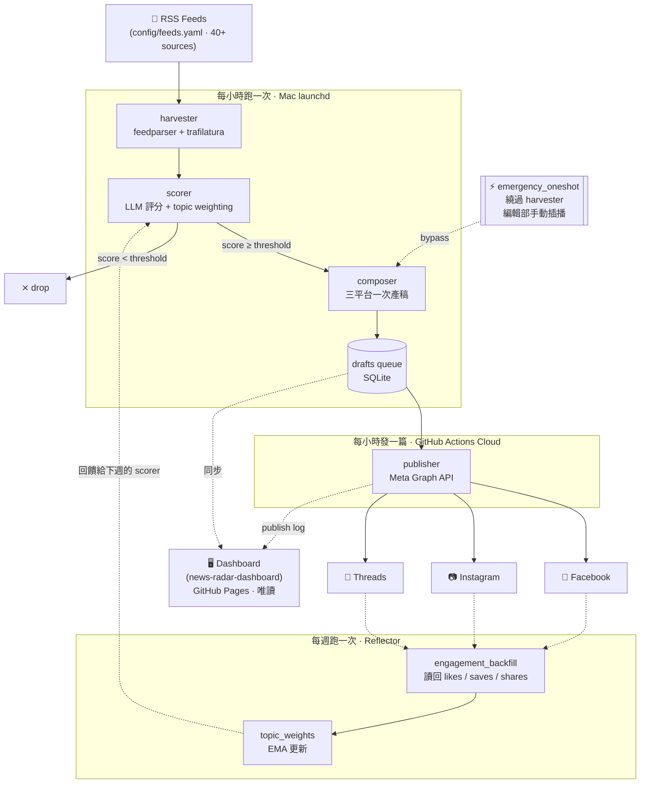

# News Radar

> 自動化科技商業新聞發布管線——從 RSS 抓取到 Facebook / Instagram / Threads 三平台同步發文，一條龍由 Python + LLM 組成。
>
> **狀態**：Production. 每小時自動運轉，每日 3–8 篇穩定產出。搭配獨立的 [dashboard](https://hsintiger.github.io/news-radar-dashboard/) 監控。

---

## What it does

接 40+ 個英文科技/商業 feed（Bloomberg、The Information、Reuters、WSJ 等），自動判斷哪些夠格發，寫成三個平台各自的中文原生貼文，排程送出——全程不需要人工手動發。每篇都會過一個 LLM-based scorer 把關，沒達到信心分數門檻就直接 drop，不浪費讀者的眼睛。

系統的三個產品化承諾：

1. **不發低質量內容**：沒有官方數據、沒有具體人名/數字、只是意見覆述的新聞，直接 drop。分數門檻 SSOT 在 `run_pipeline.py::AUTO_PUBLISH_THRESHOLD`。
2. **三平台風格原生化**：FB 長敘事、IG 視覺帶情緒、Threads 短快有 hashtag——不是同一份文案硬塞。Composer 一次 LLM call 產出三份。
3. **會進步**：`reflector.py` 每週把實際互動（likes / saves / shares）回寫成 `topic_weights` 權重，下週的選題自動往讀者真的愛的主題傾斜。

---

## Architecture (高階流程)



**設計原則**：
- **Mac composes, Cloud publishes**：compose 吃 LLM quota，留在 Mac 可以用免費額度 + 本機 cache；publish 需要穩定定時，放在 GitHub Actions。兩者靠 `state` branch 上的 SQLite DB 當單一狀態源。
- **Orphan-branch state**：`origin/state` 是獨立孤兒分支，專門扛 DB blob，不混 code。compose 前 `git fetch && reset`、compose 後 `force-push`。sha256 + SQL post-condition 雙驗證。
- **Single-clone topology**：整台 Mac 只有一份 repo clone。launchd、手動 compose、編輯都對同一份。
- **Nothing LLM for determinism**：抓取、清洗、字數過濾、模板填充——全部用程式碼完成。LLM 只做「判斷」跟「生成」兩件事，每篇 token 預算壓在 ~5000 以下。

---

## Tech stack

| 層 | 技術 |
|---|------|
| 語言 | Python 3.11 · Vanilla（無 ORM、無 framework） |
| 儲存 | SQLite（WAL mode）+ GitHub `state` orphan branch |
| 排程 | Mac launchd（compose）+ GitHub Actions cron（publish） |
| LLM | Gemini Flash 主路徑 + Claude CLI 雙路徑 fallback（`src/llm_brain.py`） |
| 發布 | Meta Graph API v20（FB Page Feed / IG Business / Threads） |
| HTTP | `httpx` async |
| 清洗 | `trafilatura` · `feedparser` · `pypdf` |
| 監控 | 獨立 repo：[news-radar-dashboard](https://github.com/HsinTiger/news-radar-dashboard) · Vite + React · GitHub Pages |

---

## Operations model

### 每小時（compose loop，Mac）

```
launchd tick
    → git fetch origin main && merge --ff-only
    → harvester → scorer → composer → write drafts
    → scripts/push_state.sh（DB → origin/state，sha256 驗）
```

### 每小時錯開 20 分鐘（publish loop，Cloud）

```
GitHub Actions cron
    → clone code from origin/main
    → fetch DB from origin/state
    → pick_freshest_queued draft → publisher
    → orphan-push updated state
```

### 每週一（reflector, Mac）

```
reflector_engagement → Meta Insights API → 寫 engagement_stats
reflector_topic → 依 engagement 聚合 → topic_weights EMA 更新
reflector → 讀 (original draft, final_text) pairs → soul.md 微調
```

### 隨時（editor override）

```
bash tools/emergency_oneshot.sh <url> [--pdf ...] [--auto-rehost]
    → 真 scorer ≥ threshold → compose → 人工 YES → publish 三平台
```

---

## Getting started

這是 operator-personal tool，**不適合 fork 自建**——裡面的 `config/news_radar_soul.md`、`config/platforms/*.md` 是針對特定 voice 的人格校準檔，換成別人用會完全不對味。但如果你想看架構學習：

```bash
git clone https://github.com/HsinTiger/news-radar.git
cd news-radar
python3 -m venv .venv && source .venv/bin/activate
pip install -r requirements.txt

# 初始化空 DB
python -c "from src.db import init_db; init_db()"

# 掃一輪 feed（會寫 news_items 表但不 LLM）
python run_harvest.py
```

完整部署（含 Meta API、GitHub Actions 設定、launchd plist）看 `docs/OPERATIONS.md` + `docs/CLOUD_DEPLOYMENT.md`。

---

## Docs map

| 文件 | 角色 |
|---|------|
| [`docs/System_Architecture.md`](docs/System_Architecture.md) | SSOT · 單一 clone topology、DB 路徑、entry point cwd 契約 |
| [`docs/PIPELINE.md`](docs/PIPELINE.md) | 每階段的 input / output / failure mode contract |
| [`docs/architecture.md`](docs/architecture.md) | 完整 Mermaid 資料流（含 hunter loop 跟 feedback loop） |
| [`docs/OPERATIONS.md`](docs/OPERATIONS.md) | Runbook · 出事怎麼救 |
| [`docs/META_API_SETUP.md`](docs/META_API_SETUP.md) | Meta 開發者 App 從零設置 |
| [`docs/CLOUD_DEPLOYMENT.md`](docs/CLOUD_DEPLOYMENT.md) | GitHub Actions + state branch 部署 |
| [`docs/worklog/`](docs/worklog/) | 每個 Claude / 我的 work session 結束後的 briefing |

---

## Current status

- 🟢 Compose loop：每小時跑，平均 5–8 篇 harvest / 0–2 篇通過門檻 compose
- 🟢 Publish loop：每小時 pick 1 篇，三平台同步
- 🟢 Reflector：每週一 06:00 UTC，engagement backfill + topic weights 更新
- 🟢 Dashboard：每 5 分鐘自動 refresh
- 🟢 Emergency publish：`tools/emergency_oneshot.sh` + `--auto-rehost`，端到端驗證過（2026-04-24）

近況細節寫在 `docs/worklog/` 最近 3 份。

---

## License

這是個人運營工具，不開放商用授權。code 結構可以參考，但 `config/*.md`（soul / persona / editorial rules）與 `data/*`（scoring weights、feed 名單、topic taxonomy）屬於 operator-specific intellectual property，不在 MIT-style 可重用範圍內。

Fork 學習可以，直接 deploy 用自己的 Meta 帳號發內容——請先把所有 `config/*.md` 全部換掉，否則你發的會是別人的 voice，不是你的。

---

<sub>Built with Python, SQLite, Gemini Flash, Meta Graph API, GitHub Actions. Original design 2026-03, production since 2026-04. Maintained by [@HsinTiger](https://github.com/HsinTiger).</sub>
