# LLM 模型調用順序（Model Routing）

**最後更新：2026-07-29**

這份文件是 `src/llm_brain.py` + `substack_radar/composer.py` 實際行為的地圖。
所有順序都以程式碼為準，不是規劃書 —— 改了程式要回來改這裡。

---

## 0. 一句話總結

- **Substack 寫稿**（長文）：`agy`（Antigravity CLI，你的 Google AI Pro 額度）→ Gemini API key → opencode → cerebras → groq。**沒有 Claude。**
- **其他所有 LLM 呼叫**（評分、分類、Meta 短文…）：Mac 上 `claude_cli` 先、雲端 `litellm` 先。
- **Substack 一次性投稿在雲端只入庫，寫稿一律在 Mac 跑**（雲端 runner 沒裝 agy / claude CLI）。

---

## 1. 一次性投稿的完整路徑

投稿頁面按下送出之後，稿子並不是在 GitHub Actions 裡寫出來的。
Actions 只負責「把素材寫進正典狀態」，寫稿發生在你自己的 Mac。

```mermaid
flowchart TD
    A["投稿頁<br/>hsintiger.github.io/news-radar/substack-submit"] --> B["control plane<br/>submission_id"]
    B --> C["GitHub Actions<br/>substack-submit.yml"]
    C --> D["scripts/submit_substack.py<br/>寫入 news_items<br/>feed_name=user_substack"]
    D --> E["state_store.py push<br/>→ GitHub Release 正典狀態"]

    E -.每 5 分鐘拉取.-> F

    subgraph MAC ["🖥 Mac — launchd com.hsin.news-radar.substack-fast（每 300s）"]
        F["state_store.py lock<br/>取得寫入 lease"]
        F --> G["state_store.py pull<br/>下載正典 DB"]
        G --> H["scripts/drain_substack.py<br/>--only-immediate"]
        H --> I["substack_radar/compose.py"]
        I --> J["compose_substack_article()<br/>→ LLM 鏈（見 §2）"]
        J --> K["寫入本機 + OneDrive<br/>+ Substack 遠端草稿"]
        K --> L["state_store.py push<br/>回寫正典狀態"]
    end

    L --> M["投稿頁顯示<br/>『Substack 草稿已建立』"]

    style MAC fill:#1a2332,stroke:#4a9eff
    style F fill:#3a1a1a,stroke:#ff6b6b
```



> **狀態語意（刻意設計，不要改成報喜）**
> - `source_queued` / 「Substack 素材已入庫（尚未建立草稿）」= Actions 成功，Mac 還沒寫稿。
> - 「Substack 草稿已建立」= 遠端草稿 ID 真的回寫了。
> - 卡在前者超過一輪，就是 Mac lane 有問題，去看 §4。

**紅框那一步（`state_store.py lock`）是 2026-07-29 事故的單點失效。** 它擋在所有 LLM 前面 ——
lease 拿不到，寫稿程式碼一行都不會執行。

---

## 2. Substack 寫稿的模型鏈

由 `.env` 的 `SUBSTACK_COMPOSER_BACKEND` 控制，程式碼預設值在
`substack_radar/composer.py:SUBSTACK_BACKEND`。目前值：

```
antigravity_cli,gemini,opencode,cerebras,groq
```



```mermaid
flowchart LR
    S["compose_substack_article()"] --> A

    A{"antigravity_cli<br/>agy -p"}
    A -->|"✅ 成功"| OUT["SubstackDraft"]
    A -->|"❌ 沒裝 agy / 失敗"| B

    B{"gemini<br/>GEMINI_API_KEY"}
    B -->|"✅"| OUT
    B -->|"❌ 沒 key / 429"| C

    C{"opencode<br/>GLM-4.6 200k"}
    C -->|"✅"| OUT
    C -->|"❌"| D

    D{"cerebras"}
    D -->|"✅"| OUT
    D -->|"❌"| E

    E{"groq"}
    E -->|"✅"| OUT
    E -->|"❌ 全掛"| FAIL["回 None<br/>→ notify_substack_failure<br/>→ exit 3"]

    style A fill:#1a3a2a,stroke:#4ade80
    style OUT fill:#1a3a2a,stroke:#4ade80
    style FAIL fill:#3a1a1a,stroke:#ff6b6b
```

| # | backend | 走哪裡 | 額度來源 | 啟用條件 |
|---|---------|--------|----------|----------|
| 1 | `antigravity_cli` | `~/.local/bin/agy -p --model "$AGY_MODEL"` | **Google AI Pro 訂閱**，token-free | `AGY_BIN` 檔案存在（只有 Mac 有） |
| 2 | `gemini` | google-genai SDK，structured output | `GEMINI_API_KEY` 免費額度 | 有 key |
| 3 | `opencode` | OpenAI-compatible，GLM-4.6 200k context | `OPENCODE_API_KEY` | 有 key |
| 4 | `cerebras` | OpenAI-compatible（8K context，殿後） | `CEREBRAS_API_KEY` | 有 key |
| 5 | `groq` | OpenAI-compatible（6K TPM，殿後） | `GROQ_API_KEY` | 有 key |

**這條鏈裡沒有 Claude。** 2026-06-01 起 Substack 寫稿刻意拿掉 `claude_cli`，
所以「Claude 沒額度」不會、也不可能擋住 Substack 寫稿。

`AGY_MODEL` 目前是 `Gemini 3.6 Flash (High)`，要跟你 `agy` CLI 裡實際看得到的模型名對齊；
名字對不上 agy 會直接失敗然後掉到 Gemini API。

---

## 3. 通用鏈（非 Substack）

`src/llm_brain.py:call_for_json()` 在 `backends=None` 時的動態預設，
由「`claude` 在不在 PATH」決定 —— 也就是自動分辨 Mac 還是 GitHub Actions runner：

```mermaid
flowchart TD
    Q{"claude CLI<br/>在 PATH？"}

    Q -->|"是（Mac）"| M1["claude_cli"]
    M1 --> M2["litellm"] --> M3["gemini"] --> M4["gemini_cli"]
    M4 --> M5["github_models"] --> M6["github_models_4o"]
    M6 --> M7["opencode"] --> M8["groq"] --> M9["cerebras"]

    Q -->|"否（Actions runner）"| C1["litellm"]
    C1 --> C2["gemini"] --> C3["github_models"] --> C4["github_models_4o"]
    C4 --> C5["opencode"] --> C6["groq"] --> C7["cerebras"]

    style M1 fill:#2a2a4a,stroke:#a78bfa
    style C1 fill:#2a2a4a,stroke:#a78bfa
```



**Quota circuit**：只在 `backends=None`（走預設鏈）時啟用。某個 backend 回額度錯誤，
`_QUOTA_EXHAUSTED_BACKENDS` 會在**同一個 process 內**記住並跳過它；
`LITELLM_MODEL` 是 `gemini/*` 時 `litellm` 和 `gemini` 視為同一份額度一起熔斷。
顯式傳 `backends=(...)`（Substack 就是）**不吃這個 circuit**。

---

## 4. 排錯順序

寫稿沒出來的時候，**由外往內**查，不要一上來就懷疑模型額度：

**先看投稿頁上那筆卡在哪一段**，決定往哪邊查：

| 頁面狀態 | 卡在哪 | 去看 |
|---|---|---|
| 「已受理，等待受治理 poller」 | 還在 Cloudflare 控制台，GitHub 都還沒收到 | §4.2 |
| 「Substack 素材已入庫（尚未建立草稿）」 | Actions 跑完了，Mac 沒接手 | §4.1 / 下面流程圖 |
| 「Substack 草稿已建立」 | 沒卡，遠端草稿 ID 已回寫 | — |

```mermaid
flowchart TD
    X["沒有草稿"] --> Q1{"launchctl list<br/>substack-fast 的 exit code？"}

    Q1 -->|"3"| F1["state_store lock 失敗<br/>👉 §4.1 GitHub token 權限"]
    Q1 -->|"4"| F2["state_store pull 失敗<br/>👉 網路 / Release 資產"]
    Q1 -->|"5 / 6"| F3["push / readback 失敗<br/>👉 寫入權限、DB 雜湊"]
    Q1 -->|"0，log 顯示 0 pending compose"| F4["投稿沒被標 immediate<br/>或已在 done / receipt 名單"]
    Q1 -->|"3 但 log 有 [ERROR] LLM total failure"| F5["這時候才是模型問題<br/>👉 §2 逐個 backend 看 raw_error"]

    style F1 fill:#3a1a1a,stroke:#ff6b6b
    style F5 fill:#2a2a1a,stroke:#facc15
```



log 位置：

```bash
tail -50 /tmp/news-radar-substack-fast.out.log
tail -20 /tmp/news-radar-substack-fast.err.log
```

### 4.1 GitHub token 權限（2026-07-29 事故）

**症狀**：`err.log` 一路刷 `asset upload failed (404)`，`out.log` 停在事故發生時間不再更新，
`launchctl list` 顯示 exit 3，投稿頁全部卡在「素材已入庫（尚未建立草稿）」。

**根因**：`gh` 的 **active account** 被切到一個對 `HsinTiger/news-radar` 只有 `pull` 權限的帳號。
`state_store.py` 舊版用不指定帳號的 `gh auth token`，就拿到那把唯讀 token。
GitHub 對「讀得到但不能寫」的 repo **回 404 而不是 403**，所以錯誤訊息完全沒提到權限。

**修法（已在程式碼裡）**：`_resolve_token()` 改成綁 repo owner 取 token，不再依賴 active account：

1. `GITHUB_TOKEN` / `GH_TOKEN`（CI）
2. `NEWS_RADAR_GH_USER` 指定的帳號
3. **repo owner 同名帳號**（`HsinTiger/news-radar` → `HsinTiger`）
4. `gh` active account（最後退路）

另外 upload 404/403 時會回頭查一次 repo permissions，把「這把 token 沒有 push 權限」直接印出來，
下次不用再從 404 猜。

自我檢查：

```bash
gh api repos/HsinTiger/news-radar --jq .permissions
```

`push` 必須是 `true`。

### 4.2 GitHub 排程 cron 被延後（2026-07-29 同日第二個問題）

**症狀**：投稿頁停在「已受理，等待受治理 poller」，GitHub Actions 上根本沒有對應的
`substack-submit.yml` run —— 因為素材連 GitHub 都還沒進去。

**根因**：`submission-poller.yml` 宣告五分鐘 cron，但 GitHub 對排程 workflow 在負載高時
會大量延後併單。當天實測 tick 間隔（UTC）：

```
14:41  12:23  10:12  07:26  04:33  01:11  23:42  22:39   ← 1~3 小時，不是 5 分鐘
```

這是平台行為，不是設定錯，`*/5` 改成什麼都一樣。

**修法（已上線）**：Cloudflare Worker 的 `createSubmission()` 在寫進 D1 之後
**直接 dispatch `submission-poller.yml`**，用的是 scheduler watchdog 本來就在用的
`GITHUB_ACTIONS_TOKEN`。cron 保留當安全網。

踢失敗**不會**讓投稿失敗 —— 已經安全落地的投稿不該因為通知沒送到就被報成 failed，
失敗只寫進 `audit_events`（`action='nudge_submission_poller'`），cron 之後照樣會撿。

驗證：投稿後 `submission-poller.yml` 應該立刻多一筆 **event=workflow_dispatch** 的 run。

```bash
gh run list --workflow=submission-poller.yml --limit 3 --json createdAt,event
```

手動急救（worker 沒上線 / 想立刻踢一次）：

```bash
gh workflow run submission-poller.yml --repo HsinTiger/news-radar
```

---

## 5. 改動這條鏈的時候

| 想改什麼 | 改哪裡 |
|----------|--------|
| Substack 寫稿順序 | `.env` 的 `SUBSTACK_COMPOSER_BACKEND`（逗號清單） |
| agy 用哪個模型 | `.env` 的 `AGY_MODEL`，要跟 agy CLI 顯示的名字**逐字**一致 |
| 通用鏈順序 | `src/llm_brain.py:call_for_json()` 的動態預設區塊 |
| 加新 provider | `_OPENAI_COMPAT` 加一筆 config 即可（OpenAI-compatible 的話） |
| 新 backend 要能被 Substack 用 | 記得同步加進 `composer.py:_KNOWN_BACKENDS`，否則會被靜默過濾掉 |

最後一列是真的坑：`_KNOWN_BACKENDS` 目前**不含 `litellm`**，
在 `SUBSTACK_COMPOSER_BACKEND` 裡寫 `litellm` 會被無聲丟掉。
