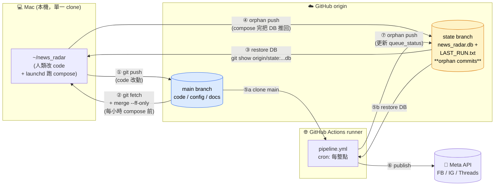

# System Architecture — News Radar SSOT (v1)

> **Scope of this doc.** `docs/architecture.md` is the canonical data-flow picture
> (Mermaid graph, Opus 4.7 pass on 2026-04-19). This doc is the **operational-reality
> companion**: where things *actually live* on disk, *when* they fire, *who* runs them,
> and *how* the Mac and Cloud stay in sync. Any time an architectural claim is
> ambiguous, this file is the ground truth; if it contradicts code, fix the code or
> the doc — no third source wins.
>
> **Last ground-truth pass:** 2026-04-28, verified against code (`src/db.py`,
> `run_pipeline.py`, `run_publish_queue.py`, `scripts/compose_hourly.sh`,
> `scripts/news_radar_engagement.sh`, `src/engagement.py`,
> `scripts/com.hsin.news-radar.compose.plist`,
> `scripts/com.hsin.news-radar.engagement.plist`), the DB itself, all three
> installed launchd plists at `~/Library/LaunchAgents/`, and last 24 h of
> compose + engagement logs (case study §7.4 added). Phase 9 Item 3
> refactor (2026-04-28) folded `src/reflector_topic.py` into
> `src/reflector/topic.py` and resolved the `src/reflector.py` ↔
> `src/reflector/` import shadow by relocating legacy soul-rule
> reflection into `src/reflector/composer_rules.py` with a re-export
> from `src/reflector/__init__.py`.

---

## 1. Single local clone topology (2026-04-23 起)

There is **one local clone** of this repo on the user's machine, and GitHub holds
the canonical history. This is the standard DVCS pattern — no "dev vs exec"
split, no "which folder do I edit in" confusion.

| Location | Path | Role | DB? |
|---|---|---|---|
| **Local clone** | `/Users/hsin/news_radar` | Human edits + `git push` + launchd + manual compose all run against this one | Authoritative runtime DB |
| **GitHub `main`** | `https://github.com/HsinTiger/news-radar.git` | Off-site canonical backup of code/config/docs | — |
| **GitHub `state`** | same remote, `state` branch | Off-site orphan-push mirror of live DB | network-transported DB lives here |

**Rule.** Source-of-truth for code is GitHub `main`. Source-of-truth for the
**live DB** is GitHub `state` branch. The local clone is a *cache*. Specifically:

- `~/news_radar` → human edits → `git commit` + `git push origin main` (same sitting)
- `~/news_radar` launchd compose → `git fetch origin main && git merge --ff-only origin/main` → runs compose → orphan-push DB to `state` branch
- GitHub Actions (Cloud publisher) → clones fresh → reads DB from `state` → publishes to Meta → orphan-pushes updated `state`

**Golden rule:** edit → commit → push all in the same sitting. The hourly
`compose_hourly.sh` expects `--ff-only` to succeed; any local commit you leave
un-pushed will make the next cycle fail loudly (by design — §5.3).

### 1.1 Historical note: why this used to be three clones

Pre-2026-04-23 there was also an **OneDrive clone** at `~/Library/CloudStorage/OneDrive-.../news_radar`
for cross-device auto-sync of uncommitted work. It was retired because:
- GitHub is a better backup for code (full history, branches, rollback; OneDrive only mirrors latest state)
- OneDrive silently modifies file mtime causing phantom git diffs
- OneDrive occasionally produces `... (conflicted copy).py` sibling files
- The "commit + push in same sitting" habit makes OneDrive's cross-device sync niche unnecessary

If you ever need a cross-device editing workflow again, prefer `git clone` on the
second device over OneDrive.

---

## 2. Every DB instance on disk (derived from code)

All paths below were read from source, not recalled. If source changes, update
this table in the same commit.

| Symbol | Resolves to (on Hsin's Mac) | Source | Notes |
|---|---|---|---|
| `src/db.py: DB_PATH` | `/Users/hsin/news_radar/data/01_harvest/news_radar.db` | `src/db.py:19-20` — `_BASE = Path(__file__).resolve().parent.parent; DB_PATH = _BASE/"data"/"01_harvest"/"news_radar.db"` | **Anchored to code location**, immune to cwd. This is the "real" runtime DB for compose/scorer/composer/publisher. |
| `src/db.py: SCHEMA_PATH` | `/Users/hsin/news_radar/data/01_harvest/schema.sql` | `src/db.py:21` | Init-db reads this. |
| `scripts/*.py: _DB_PATH` | same as `DB_PATH` | `morning_report.py:36`, `classify_dryrun.py:44`, `queue_inspect.py:33`, `flush_legacy_drafts.py:62` all use `_ROOT/"data"/"01_harvest"/"news_radar.db"` with `_ROOT` resolved from `__file__` | Consistent with `src/db.py`. |
| `src/export_drafts.py: DB_PATH` | `/Users/hsin/news_radar/db/news_radar.db` ⚠️ **wrong path, file does not exist** | `src/export_drafts.py:11` | Bug, not currently a live footgun (script apparently unused). Park it. |
| GitHub `state` branch blob | `origin/state:data/01_harvest/news_radar.db` | `scripts/compose_hourly.sh` does `git show origin/state:data/01_harvest/news_radar.db > data/01_harvest/news_radar.db` at start of each run | This is the network-transported DB. Size as of 2026-04-22 04:30 UTC: 1,658,880 bytes. |

On disk today there is exactly **one** `news_radar.db` file under the local
clone (verified via `find ~/news_radar -name "*.db" -not -path "*/.venv/*"`).

---

## 3. Entry-point cwd contracts

Every entry point has an implicit cwd expectation. When it holds, paths resolve
correctly; when it doesn't, something usually still "runs" but writes to the
wrong place. `src/db.py` uses `__file__`-anchored paths so it is cwd-independent,
but some sibling scripts resolve files via `pathlib.Path(...)` relative to cwd.

| Entry point | Where it's called from | Required cwd | Consequence if wrong |
|---|---|---|---|
| `run_pipeline.py` | `scripts/compose_hourly.sh` at `~/news_radar/` | `~/news_radar/` | Reads `.env` from cwd, reads `config/*`, writes `logs/`, writes `data/03_compose/pending_drafts/`. Wrong cwd → `.env` missing → Gemini key not loaded. |
| `run_publish_queue.py` | GitHub Actions `pipeline.yml` step | repo root (actions checkout) | Same concerns as above; CI sets cwd correctly. |
| `scripts/compose_one.py` | Manual: `python -m scripts.compose_one ...` | `~/news_radar/` | `compose_one.py:42-44` prepends `ROOT = Path(__file__).resolve().parents[1]` to sys.path, so import works regardless. But it still uses the `.env` in cwd. |
| `scripts/morning_report.py` | GH Actions daily; also manual | repo root | cwd-independent for DB path (via `__file__`), but other outputs depend on cwd. |
| `scripts/push_state.sh` (v1, 2026-04-22) | Manual | repo root (auto-detects by walking up for `.git`) | Auto-recovers if called from subdir; fails loudly if no repo found. |

**Pragma:** if you add a new entry point, anchor paths with `Path(__file__).resolve().parent(s)` — never raw relative paths — and put the expectation here.

---

## 4. Workflow triggers & concurrency

### 4.1 Mac end (launchd)

| Agent | Schedule | Real script at | Logs |
|---|---|---|---|
| `com.hsin.news-radar.compose` | `StartInterval 3600` (every 1 h from load time) | `~/bin/news_radar_compose.sh` (source: `scripts/compose_hourly.sh`) | `~/news_radar_snapshots/_compose_logs/YYYYMMDD_HHMMSS.log` + `/tmp/news-radar-compose.{out,err}.log` |
| `com.hsin.news-radar.engagement` | `StartInterval 3600` (every 1 h, log-scale bucket dispatch within ±15min of [1h, 24h, 168h] post-age tolerance windows) | `~/bin/news_radar_engagement.sh` (source: `scripts/news_radar_engagement.sh`) | `~/news_radar_snapshots/_engagement_logs/YYYYMMDD_HHMMSS.log` + `/tmp/news-radar-engagement.{out,err}.log` |
| `com.hsin.news-radar.snapshot` | Sunday 10:30 local | `~/bin/news_radar_weekly_snapshot.sh` | `~/news_radar_snapshots/_logs/YYYYMMDD_HHMMSS.log` |

The plists at `~/Library/LaunchAgents/com.hsin.news-radar.*.plist` are produced
from the repo's `scripts/com.hsin.news-radar.*.plist` by the `sed "s|HOME_DIR|$HOME|g"`
step in `scripts/INSTALL_COMPOSE_LAUNCHAGENT.md`. The **repo version contains
`HOME_DIR`**, the **installed version contains `/Users/hsin`**. Both are valid
plists; if they drift otherwise that's a bug.

**Important: launchd's PATH is not inherited from the login shell.** It takes
exactly what `EnvironmentVariables.PATH` says in the plist. As of 2026-04-22 that
is `HOME_DIR/.local/bin:/opt/homebrew/bin:/usr/local/bin:/usr/bin:/bin` (see
§7.2 case study for why `HOME_DIR/.local/bin` is required).

### 4.2 Cloud end (GitHub Actions)

| Workflow | Schedule | What it does |
|---|---|---|
| `pipeline.yml` | `cron: 0 * * * *` (hourly on :00) | Clone main → restore DB from `state` → `python run_publish_queue.py` → push `state` |
| `reflect_topic.yml` | `cron: 0 22 * * 0` (Sun 22:00 UTC ≈ Mon 06:00 Taipei) | Weekly topic-weight back-prop |
| `reflect_harvest.yml` | `cron: 0 3 * * *` (daily 03:00 UTC ≈ 11:00 Taipei) | Daily harvest analyzer (Phase 9 Item 4) — feed-yield evaluation, proposal-only sunset/investigation entries |
| `reflect_scorer.yml` | `cron: 0 4 * * *` (daily 04:00 UTC ≈ 12:00 Taipei) | Daily scorer analyzer (Phase 9 Item 6) — per-platform AUTO_PUBLISH threshold optimization, proposal-only |
| `feed_healthcheck.yml` | daily | Pings feed URLs, opens GH Issue on failure |

### 4.3 Concurrency & race windows

Both the hourly compose (Mac, :30) and the hourly publish (Cloud, :00)
force-push `state` branch. They deliberately stagger by ~30 min. If their
timings cross, the later force-push overwrites the earlier — this is
**acceptable** because compose only writes new drafts and publisher only writes
updated `queue_status` / `publish_log`, and they work on disjoint rows (publish
touches drafts that compose has already finalized in previous cycles).

All Actions workflows use the same concurrency group `news-radar-pipeline` to
serialize themselves with each other. The Mac side has no such guard — it
trusts the force-push race window to be wide enough.

---

## 5. Mac ↔ Cloud sync contract

Three branches carry three kinds of state:

| Branch | Contains | Who writes | Who reads |
|---|---|---|---|
| `main` | Code, config, docs, tests | Humans (via local clone `~/news_radar` → push) | Everyone fetches this |
| `state` | `data/01_harvest/news_radar.db`, `state/last_harvest.txt`, `archive/`, `LAST_RUN.txt` | Mac `compose_hourly.sh`, Mac `news_radar_engagement.sh` (via `push_state.sh` since 2026-04-26 fix), Mac `push_state.sh`, Cloud `pipeline.yml`, Cloud `reflect_topic.yml` | Mac compose, Mac engagement worker, Cloud publisher — **force-pushed orphan commits, no history retention** |
| `gh-pages` or none for docs | — | — | — |

### 5.1 The orphan-commit pattern

Every writer of `state` branch creates a fresh orphan commit (`git init -b state`
in a tmpdir, copy files in, commit once, force-push). This means `state` has no
git history and its commits can be overwritten freely. The writer's identity is
recorded in `LAST_RUN.txt` (kind, UTC timestamp, host, optionally DB hash).

**Why orphan:** history would balloon the repo (DB is ~1.6 MB, changes every
hour, so 24×365 = 8.7k commits/year). Orphan keeps repo size flat.

### 5.2 What `push_state.sh` adds (new, 2026-04-22)

`scripts/push_state.sh` is a manual-triggered variant of the state-branch push
logic in `compose_hourly.sh`, with two additions that close the 2026-04-20 hole:

1. **sha256 post-condition.** After push, it re-fetches `origin/state`, extracts
   the DB, and asserts the remote blob's sha256 matches local. If not, exit 1.
2. **Optional `--expect-draft <id>`.** Pre-push, SQL-assert the id exists locally;
   post-push, SQL-assert the id exists in the re-fetched DB. This is the
   "I pushed a queued draft and need to confirm it landed" workflow.

Anything that writes a draft and then claims "it's queued" should pipe through
`push_state.sh --expect-draft <new_id>` or equivalent — log lines alone are not
evidence.

### 5.3 Hybrid 兩方同步視覺圖（Mac × Cloud × GitHub）

§5 的表格用 prose 講完了誰讀誰寫，這裡補一張可以 30 秒看懂的視覺版。
兩個本地／遠端實體、兩條分支、七條 recurring 路徑。



**分工規則（記兩條就夠）**：

1. **`main` 分支 = 程式碼／設定／文件**：只有人類會寫（`~/news_radar` → `git push`）。launchd 自動流程只讀 main，不寫。
2. **`state` 分支 = 執行狀態（DB + LAST_RUN.txt）**：Mac 的 launchd compose 跟 Cloud runner 都會寫，都是 **orphan force-push**（無歷史，只保留最新一份）。

**黃金法則**：edit → commit → push 一次坐下做完。不要留 uncommitted / unpushed 的改動過夜——下次 launchd compose 跑 `git merge --ff-only` 時會碰到「本地有新 commit 但沒 push」而卡住（這是刻意設計的，見下）。

**為什麼是 `--ff-only`（Phase 8.20 後）而不是 `git reset --hard`**：
`--ff-only` 只允許「純粹向前」的更新；如果本地意外有了未 push 的 commit（例如 debug 手癢），merge 會拒絕並報錯，讓你人工決定是要 push 還是放棄。`reset --hard` 則會無聲蓋掉——曾經發生過一次本地 hotfix 被清掉的事故。這是從「黃金法則違規」恢復的安全網。

---

## 6. Queue state machine

Reading `drafts` table columns `status` + `queue_status`:

| `status` | `queue_status` | Meaning |
|---|---|---|
| `pending_review` | `NULL` | Scorer said ≥0.65 but <0.9 — composed, not auto-publishable, not queued |
| `auto_approved` | `NULL` | Just composed, waiting to be enqueued (transient; compose should set queue_status in the same transaction) |
| `auto_approved` | `queued` | Ready for Cloud publisher to pick |
| `auto_approved` | `published` | Cloud publisher succeeded on ≥1 platform |
| `auto_approved` | `failed` | Guard blocked / Cloud publisher all-platforms-failed |
| `auto_approved` | `stale` | An older queued draft superseded by a fresher one |
| `published` | `published` | Legacy / post-hoc consistency state |

**Current DB snapshot (2026-04-22 06:00 UTC):**

```
status='auto_approved'  qs='failed'      n=18
status='pending_review' qs='failed'      n=12
status='pending_review' qs=NULL          n=3    ← 2026-04-20 15:59–16:07 drafts
status='published'      qs='published'   n=1
(zero queued)
```

The three `qs=NULL` rows from 2026-04-20 are the **last real composer outputs
on this system**. Everything since then is no-ops due to §7.1. Nothing is
eligible for today's publish without either new compose or manual promotion.

### 6.2 Substrate views (Phase 9 Item 1, 2026-04-27; Item 1.5 fold-in 2026-04-27; Item 1.6 extension 2026-04-28)

Phase 9's unified reflector reads from a thin SQL-view layer rather than
issuing direct queries against base tables. Views live in
`data/01_harvest/views.sql` and are sourced by `src/db.py::init_db` **after**
`schema.sql` + all column migrations (Phase 8.18 `queue_status`, Phase 8.20
`topic_category` / `weighted_score`, Phase 8.16 video columns). Idempotent
via `CREATE VIEW IF NOT EXISTS`; cheap to re-run on every init.

| View | Purpose | Downstream Phase 9 consumer |
|---|---|---|
| `v_post_engagement_aggregated` | **Foundation.** One row per published draft (`drafts.queue_status='published' OR drafts.status='published'`) joined to `news_items`, with the latest per-platform engagement snapshot pulled from `engagement_stats` via correlated subqueries (NULL when a platform has no row). **Item 1.5 (2026-04-27):** added `confidence_score` column (from `drafts.confidence_score`) so downstream analyzers can correlate composer's pre-publish self-rating against realized engagement. | Item 5 composer analyzer + Item 6 scorer analyzer; also feeds the three derived views below. |
| `v_drafts_with_outcome` | Adds `engagement_quartile` via `NTILE(4) OVER (PARTITION BY topic_category)` over the trailing 14-day window. | Item 5 composer analyzer's top-Q vs bot-Q sibling sampler (canonical §8.3 row 4). |
| `v_feed_yield_7d` | Per-feed 7-day publish/fetch counts, average weighted_score, and `engagement_yield_ratio` (share of fetched items that ended up published with non-zero engagement). | Item 4 harvest analyzer's feed sunset/boost proposals (canonical §8.3 row 1). |
| `v_topic_engagement_x_platform` | Per-topic × platform engagement averages over the trailing 30-day window, plus `sample_count` for the §1.2 sample-size gate. **Item 1.6 (2026-04-28)** extends the view with the full per-platform AVG metric set so the Hsin-pinned engagement formula has the substrate it needs without re-deriving off base tables: FB now exposes `fb_avg_likes_30d`/`fb_avg_comments_30d`/`fb_avg_shares_30d`/`fb_avg_reach_30d`; IG exposes `ig_avg_likes_30d`/`ig_avg_comments_30d`/`ig_avg_shares_30d`/`ig_avg_saves_30d`/`ig_avg_reach_30d`; Threads exposes `th_avg_likes_30d`/`th_avg_replies_30d`/`th_avg_reposts_30d`/`th_avg_quotes_30d`/`th_avg_views_30d`. Existing AVG columns + `sample_count` + GROUP BY untouched; the new view definition uses `DROP VIEW IF EXISTS` so older DBs pick up the new columns on next `init_db`. The per-row columns on `v_post_engagement_aggregated` were already complete since Item 1 (FB: likes/comments/shares/views/reach; IG: likes/comments/saves/shares/reach; Threads: likes/replies/reposts/quotes/views) — Item 1.6 verified this and only changed the topic-AVG view. | **Consumed by Item 3 reflector topic analyzer (`src/reflector/topic.py`, 2026-04-27)** — supplies per-platform aggregates that flow into proposal evidence metrics + sample_count cross-check. Math inputs (median+normalize on per-row scores) still come from base tables (Item 3's dual-source math is parked as future tech debt per Hsin's Cowork ruling 2026-04-28; see `audits/2026-04-28_phase9_item1_6_substrate_extension.md` and `audits/2026-04-28_phase9_item3_reflector_topic_refactor.md`). |
| `v_draft_hook_by_platform` (Item 1.5, 2026-04-27) | Per-platform-per-draft "hook" extraction joined (LEFT JOIN) to engagement metadata. Hook rule: facebook = first 100 chars of `platform_drafts.full_text`; instagram = substring before first newline (or full text if none); threads = first 30 chars. Engagement columns are NULL for drafts not yet published. | Item 5 composer analyzer (hook-pattern correlation) + Item 6 scorer analyzer (per-platform first-impression scoring). |

`v_post_engagement_aggregated` is the foundation; `v_drafts_with_outcome` /
`v_feed_yield_7d` / `v_topic_engagement_x_platform` are derived layers that
read from it (or from the same base tables in the same join shape, for
consistency). No materialization, no indexes added — view evaluation is
SELECT-time. If analyzer query patterns later surface a hot path, indexes
get added against the base tables (out of scope for Item 1, see spec).

State-branch implication: views are evaluated against whichever DB the
consumer reads from. The state branch carries the base tables only —
each consumer's local `init_db` re-creates the views on top of the
state-restored schema. No view DDL is committed to the state branch.

### 6.3 Reflector proposal substrate (Phase 9 Item 2, 2026-04-27)

Phase 9 analyzers (Items 3-7) record every proposal-firing in two
storage layers, kept in lockstep by `src/reflector/proposals.py`:

| Layer | Path / object | Role |
|---|---|---|
| **JSONL (canonical)** | `data/05_reflect/proposals/YYYY-WW.jsonl` | Append-only, human-readable, git-friendly audit trail. One file per ISO week, one JSON object per line. Schema per spec §3 Item 2 lines 134-156 of `PM_Radar/specs/phase_9_implementation_plan.md`. |
| **SQLite (mirror)** | `reflector_proposal_lineage` table | Queryable mirror for cross-analyzer SQL (recent proposals from analyzer X, pending decisions, approved-but-not-deployed). Schema in `data/01_harvest/schema.sql §9` + migration `2026-04-27_phase9_proposal_lineage.sql`. Index on `(analyzer, fire_at)` for the cooldown-window hot query. |

**Why both:** the JSONL is the durable, easy-to-grep, easy-to-PR-review
record (git diff of `data/05_reflect/proposals/2026-W18.jsonl` shows a
boss exactly what an analyzer fired this week). The sqlite mirror lets
analyzers and the (future) review UI run set queries without parsing
N week-files.

**Write-path API:** `news_radar/src/reflector/proposals.py`. Public
functions: `write_proposal(proposal) -> fire_id`, `read_proposals(week=None)`,
`update_decision(fire_id, decision, comment)`. Validation rejects
malformed proposals (missing fields, out-of-enum analyzer/platform/
proposal_type/target_config/confidence) BEFORE any side effect.
`write_proposal` appends jsonl first, inserts the lineage row second,
and rolls back the jsonl line by truncation on lineage failure.
`update_decision` rewrites the entire week-file via tmp + `os.replace`
(atomic on POSIX) and updates the lineage row in the same call;
in-place jsonl line edits are deliberately avoided because line
length is variable.

**Cadence:** there is **no standalone proposal-substrate cron**. Items
3-7 each fire on their own schedule (Item 3 weekly Mon 06:00 TW,
Item 4 daily, etc.) and call `write_proposal` directly. Hsin's
review cadence is weekly — Items 3-7 set `boss_attention_required`
appropriately, Item 2 just records.

**State-branch propagation:** wired by Item 3 (2026-04-27).
`src/reflector/topic.py::_maybe_push_state_branch` invokes
`scripts/push_state.sh` (extended in Amendment B `708ed93` to include
`data/05_reflect/proposals/`) when ALL of these hold:
  1. The run wasn't dry-run.
  2. ≥1 category crossed the sample gate this run (i.e. produced a
     proposal entry, regardless of branch).
  3. The `PUSH_STATE` env var is set to `1`/`true`/`yes`.

The env-var gate keeps local dev runs from accidentally pushing to the
state branch. The cron workflow `.github/workflows/reflect_topic.yml`
runs its own state-branch push step (the existing "Persist state" step,
unchanged by Item 3) which already includes the proposals dir via the
extended push_state.sh contract — the in-process trigger is the
fallback for non-CI cron contexts (e.g. launchd-only deployments).
Items 4-7 will reuse this same trigger pattern.

### 6.4 reflect_harvest analyzer (Phase 9 Item 4, 2026-04-28)

`src/reflector/harvest.py` is the second Phase 9 sub-analyzer. **Daily**
cron (`.github/workflows/reflect_harvest.yml`, 03:00 UTC ≈ 11:00 TW),
non-overlapping with `reflect_topic.yml` (Sun 22:00 UTC weekly). Reads
`v_feed_yield_7d` (Item 1, no Item 1.6 dependency) and writes per-feed
proposals to `data/05_reflect/proposals/YYYY-WW.jsonl` via
`src.reflector.proposals.write_proposal` — same Item 2 substrate as
Item 3.

**Two proposal lanes, both PROPOSAL-ONLY** (`boss_attention_required=True`):

| Lane | Trigger | `evidence.metrics.signal` | `action.proposed_value` |
|---|---|---|---|
| **sunset_feed** | `engagement_yield_ratio < 0.05` AND `feed_age_days ≥ grace_days` (cadence-aware: 28d standard / 56d for `source_tier: official` or unknown cadence) AND `publish_count_7d ≥ 3` AND not boss-pinned | `low_yield_sunset` | `sunset` |
| **investigation** (modeled as `proposal_type: sunset_feed`) | `publish_count_7d == 0` AND feed has historical `status='published'` rows older than 7 days | `zero_publish_with_history` | `investigate` |

**Skip reasons** (no proposal written, surfaced in per-run report):
`skip:null_score` (NULL `avg_score_7d` per Cowork 2026-04-27 ruling —
DEBUG-log emitted, never silent), `skip:samples`, `skip:grace`,
`skip:pinned`, `skip:unconfigured` (feed in view but absent from
`config/config.yaml`), `skip:ok` (yield healthy), `skip:zero_no_history`
(brand-new feed with no historical publishes).

**Cadence signal source:** the feed cadence is read from
`config/config.yaml`'s `feeds:` block. There is no explicit
`expected_cadence_per_week` field today — cadence is *derived* from
`source_tier: official` / `source_class: official` (low-cadence, ~1/week)
with all other tiers treated as high-cadence (≥ 4/week). Unknown cadence
defaults to **8-week grace** (conservative). The single point of update
is `derive_expected_cadence()` in `harvest.py`.

**`feed_added_at` source:** parsed from `config/config.yaml` per-feed
ISO-8601 string. Pre-Phase-8.24 feeds (most of the list) do not carry
`feed_added_at` — those feeds get `skip:unconfigured` rather than a
sunset proposal, since we cannot defend an age claim without the field.
This intentionally narrows Item 4's blast radius to the 6 boss-driven
international-official feeds added 2026-04-26 (and any future feeds with
explicit `feed_added_at`).

**Boss-pinned feed gate:** currently a forward-compat stub
(`_is_feed_boss_pinned`) — Item 8 will introduce the real signal
(either a `boss_pinned: true` field per feed in `config/config.yaml`
OR a `feeds.boss_pinned` column). Until then no feed is pinned in
production. The defensive PRAGMA-based check picks up either path
without code change. Same pattern as Item 3's `_is_boss_pinned`.

**No auto-deploy:** harvest analyzer never modifies `feeds.yml`
directly. Sunset is a destructive operation that always requires Hsin
sign-off. Therefore `mark_deployed()` is never called from this module
(unlike `topic.py`'s auto-deploy lane).

**Per-run markdown report (Task C absorption):** every non-dry-run
cycle writes `reports/harvest_<YYYY-MM-DD>.md` with feeds_evaluated /
sunset_count / investigation_count / per-feed verdict + reason. This
subsumes the audit-flagged gap that `tools/dryrun_official_feeds.py`
didn't write reports to disk — that tool's role is satisfied by this
analyzer's natural output. Workflow commits the markdown to `main`
(same shape as `reflect_topic.yml`'s `docs/topic_weight_log/` commit
step).

**State-branch propagation:** `_maybe_push_state_branch()` mirrors
`topic.py`'s env-var-gated subprocess pattern. Same trigger conditions:
non-dry-run AND ≥ 1 proposal written AND `PUSH_STATE` env var set.
The cron workflow's own "Persist state" step is the production
propagation path; the in-process trigger is the launchd-fallback.

### 6.5 reflect_scorer analyzer (Phase 9 Item 6, 2026-04-28)

`src/reflector/scorer.py` is the third Phase 9 sub-analyzer. **Daily**
cron (`.github/workflows/reflect_scorer.yml`, 04:00 UTC ≈ 12:00 TW),
deliberately staggered one hour after Item 4's `reflect_harvest.yml`
(03:00 UTC) to avoid same-time CI contention on the
`news-radar-pipeline` concurrency group. Reads
`v_post_engagement_aggregated` (Item 1, Item 1.6's full per-platform
column extension required) and writes per-platform AUTO_PUBLISH
threshold proposals to `data/05_reflect/proposals/YYYY-WW.jsonl` via
`src.reflector.proposals.write_proposal`.

**Per-platform analysis** (FB / IG / Threads, independent):

1. Pull every published draft from the last **30 days** for this
   platform via the substrate view.
2. Drop rows where the platform's engagement columns are ALL NULL —
   the engagement worker hasn't polled them yet, so they don't carry
   a curve-fitting signal. A separate "polled with 0 engagement" row
   IS included (any non-NULL column = polled).
3. **Sample-size gate:** < 30 polled-published rows → SKIP this
   platform. Write a **lineage-skip row** (no jsonl entry) tagged
   with `evidence.reason="insufficient_samples"`.
4. Bucket each row's `weighted_score` to nearest 0.05 via Python
   `round()` (banker's rounding — half-to-even — chosen over half-up to
   avoid systematic upward bias on bucket boundaries).
5. Compute `engagement_weight` per row using the **Hsin-pinned formulas**
   (Phase 8.20 verbatim, codified in `src/reflector/_engagement.py`):
   - FB:      `likes + 2*comments + 3*shares + 0.01*reach`
   - IG:      `likes + 2*comments + 3*shares + 1.5*saves + 0.01*reach`
   - Threads: `likes + 2*replies  + 3*reposts + 1.5*quotes + 0.005*views`
6. Grid-search threshold T over [0.30, 0.95] in 0.05 steps, scoring
   `mean(engagement_weight | weighted_score >= T)` (mean-of-tail =
   per-published-post engagement). Sub-threshold tails (< 5 rows)
   score 0 — guards against an optimum on a sparse top-bucket.
7. **Sanity-bound clamp** to `[0.50, 0.95]`. If unconstrained T < 0.50
   → propose 0.50 with `evidence.metrics.bound_hit="lower"`. If > 0.95
   → 0.95 with `bound_hit="upper"`.
8. **Noise floor:** `|delta| < 0.02` → no jsonl proposal, lineage-skip
   row with `evidence.reason="below_noise_floor"`.
9. **Calibration override** (Phase 9 §8.4): every actionable proposal
   carries `boss_attention_required=True` regardless of |delta|.
   `mark_deployed()` is never called from this module — Item 6 in
   calibration mode is strictly proposal-only. Phase 9 graduation
   flips this gate; until then auto-deploy is disabled.

**Proposal payload shape:**
- `analyzer="scorer"`, `proposal_type="tune_threshold"`,
  `platform=<facebook|instagram|threads>`.
- `action.target_config="thresholds.yml"`,
  `action.field="per_platform.<fb|ig|threads>.AUTO_PUBLISH"`.
- `evidence.confidence`: HIGH if `sample_count ≥ 60` AND `bound_hit is
  None`; MED otherwise (clamping demotes confidence — the data wanted
  to go further than our sanity rails).
- `evidence.sample_ids`: empty (curve-level proposal, not draft-level).
- `evidence.metrics`: `sample_count`, `excluded_unpolled`, current /
  proposed thresholds, delta, `engagement_per_post_at_*` for both
  thresholds, `total_engagement_lift_estimate`, `bound_hit`,
  `window_days`.

**Spec interpretation note** (audit-flagged for PM ratification, see
`PM_Radar/audits/2026-04-28_phase9_item6_scorer_analyzer.md`): the
spec's literal objective `mean(...) × (count_at_or_above_T /
total_count)` is algebraically equivalent to `sum_in_tail / N`, which
is monotonically non-increasing in T for non-negative weights — the
unconstrained optimum is always GRID_LO and the formula does NOT
"balance per-post quality with publish volume" as labeled. This module
implements the **mean-of-tail** interpretation (matches the spec's
named metric `engagement_per_published_post`) plus a
`MIN_TAIL_FOR_FIT=5` sparse-tail guard. Documented for PM sign-off
before Item 7 lands.

**`thresholds.yml` schema** (introduced by Item 6 — file did not
exist prior; production `AUTO_PUBLISH` lives as a Python constant
in `run_pipeline.py` until graduation deploys catch up). Resolution
order for any consumer:
1. `per_platform.<plat>.AUTO_PUBLISH` if file + key exist.
2. Top-level `AUTO_PUBLISH` as global default.
3. Hard-coded `0.70` (matches today's `run_pipeline.py` constant).

The reader helper is `src.reflector.scorer.read_current_threshold()`.
Existing constants in `run_pipeline.py` and `tools/emergency_oneshot.py`
are NOT yet refactored to read this file — the cutover is parked as a
Phase 9 follow-up (calibration phase makes everything proposal-only;
no auto-deploy reads thresholds.yml today). See the Item 6 audit for
the full parked-consumers list.

**Per-run markdown report (Task C absorption):** every non-dry-run
cycle writes `reports/scorer_<YYYY-MM-DD>.md` with one section per
platform: sample_count, current/proposed thresholds, delta, bound_hit,
confidence, engagement_per_post for both thresholds, and a per-bucket
histogram. Workflow commits the markdown to `main` (same shape as Item
3's `docs/topic_weight_log/` and Item 4's `reports/harvest_*.md`).

**State-branch propagation:** `_maybe_push_state_branch()` mirrors
`topic.py` / `harvest.py`'s env-var-gated subprocess pattern. Trigger
conditions: non-dry-run AND ≥ 1 fire_id produced (actionable OR skip
lineage row) AND `PUSH_STATE` env var set. The cron workflow's own
"Persist state" step is the production propagation path.

**Engagement-weight helper placement:** `src/reflector/_engagement.py`
(new leaf module, zero dependencies on `proposals.py`/`db.py`). The
formulas are pure and Hsin-pinned, so they're shared across analyzers
that correlate signal with engagement (Items 5/6/7). Imported by Item
6 today; Items 5 / 7 will pick it up when they ship.

---

## 7. Case studies — failures that forced doc updates

### 7.1 Gemini 429 × Claude CLI not-in-PATH = silent pipeline stall

**Symptom (2026-04-20 evening onward):** Hourly compose appears to run. Every log
ends with `pipeline exit code: 0` and `state branch 已更新`. But `drafts` table
stops receiving new rows after 2026-04-20T16:07. Publisher queue goes empty and
stays empty.

**Root cause** (verified 2026-04-22 from `~/news_radar_snapshots/_compose_logs/20260422_*.log`):

1. Gemini free tier quota is 20 req/day on `gemini-3-flash` (as of April 2026).
   User's `.env` key burned through daily by hourly composes + morning_report +
   reflect_topic. Every hour from somewhere around daily reset, scorer hits 429.
2. `src/llm_brain.py:146-150` defines `_claude_cli_available()` as
   `shutil.which(CLAUDE_CLI_BIN) is not None`.
3. launchd's plist PATH was `/opt/homebrew/bin:/usr/local/bin:/usr/bin:/bin`.
   Claude CLI is installed via the native installer at
   `/Users/hsin/.local/bin/claude` (symlink → `/Users/hsin/.local/share/claude/versions/<v>`),
   which is **not** in that PATH. So `which` returned None, Claude fallback path
   never activated.
4. Scorer falls through to `return None` → `process_item` returns
   `"skipped_no_llm"` → no draft written → commit is empty → state branch
   push happens but the DB is unchanged (LAST_RUN.txt bumps prevent "no commit"
   skip, so the push appears to succeed).
5. Hunter loop scans 8 items, all skip, loop terminates cleanly — the
   `pipeline exit code: 0` comes from a well-behaved skip, not from successful
   work.

This is also the origin of the "compose_one reported qs=queued but DB empty"
handoff report on the morning of 2026-04-22: the prior agent read "queued" in
the log out of context, but `process_item` almost certainly returned
`skipped_no_llm`. Final verification would require the terminal scrollback
from that run, which has been lost; hypothesis stands.

**Fix (applied 2026-04-22):** Update plist PATH to include `HOME_DIR/.local/bin`
(see `scripts/com.hsin.news-radar.compose.plist`; installed version at
`~/Library/LaunchAgents/` same but with `/Users/hsin/`). After user runs
`launchctl unload/load`, the next hourly compose will have `claude` on PATH
and the Phase 8.19 fallback will activate when Gemini 429s.

**Detection going forward:** `scripts/morning_report.py` should include a
"LLM path health" section — count of `skipped_no_llm` returns in the last 24 h.
If every cycle skipped → page. (Noted as follow-up; not implemented in this
session.)

### 7.2 Launchd minimal PATH trap

The generalization of §7.1: **launchd does not inherit the login shell's
PATH**. If a binary is installed under `~/.local/bin`, `~/.npm-global/bin`,
`~/.volta/bin`, nvm, mise, conda, or any other user-level prefix, it must be
explicitly listed in `EnvironmentVariables.PATH` inside the plist (or the
script must hard-code the absolute path). Don't assume that "works in my
terminal" means "works under launchd".

**Smoke test before deploying any plist change:**

```bash
# Simulate launchd's PATH, check the binary you depend on
env -i PATH='<same string as plist>' your_binary --version
```

If that fails, launchd will fail too.

### 7.4 Engagement worker writes clobbered by compose's state-restore (2026-04-26)

**Symptom (2026-04-25 → 2026-04-26):** State-branch DB's `engagement_stats`
table sits 17.5 h stale despite the new hourly engagement worker
(`com.hsin.news-radar.engagement`, added 2026-04-25) firing every hour and
its log saying `OK=N committed`. Local DB equally stale. Specifically: only
3 rows from `2026-04-26T07:02 UTC` survived in DB; runs at 11:02 / 13:02 UTC
each claimed to commit ≥1 row but those rows were nowhere on disk hours later.

**Root cause** (verified 2026-04-26 by correlating engagement worker logs
in `~/news_radar_snapshots/_engagement_logs/` with compose logs in
`~/news_radar_snapshots/_compose_logs/`):

1. Engagement worker writes to `data/01_harvest/news_radar.db` and commits.
2. ~3-25 minutes later, `compose_hourly.sh` line 76 runs
   `git show origin/state:data/01_harvest/news_radar.db > data/01_harvest/news_radar.db`
   to "restore" DB from state branch. This is a **whole-file overwrite** —
   any local engagement_stats writes since the last state-push are lost.
3. Compose then runs the pipeline and pushes the resulting (engagement-free)
   DB back to state. State-branch engagement_stats stops advancing.
4. The only engagement rows that survive are ones written in the narrow
   window between compose's restore step and compose's push step (typically
   <3 minutes per cycle). E.g. the 2026-04-26T07:02:50 rows survived because
   compose at 15:02:11 CST started its restore, then engagement at 15:02:50
   CST won the race against compose's push at ~15:05.

The original `news_radar_engagement.sh` comment explicitly said "不 push_state，
等下一次 compose_hourly.sh 順手帶上去" — that assumption was wrong: compose's
restore is destructive, not additive.

**Fix (2026-04-26):** `news_radar_engagement.sh` now compares
`MAX(fetched_at)` from `engagement_stats` before vs after `python -m
src.engagement`. If new rows were written, it calls `scripts/push_state.sh`
immediately to orphan-push the DB to state. Concurrent-writer race with
compose is acceptable because (a) state-branch already documents
disjoint-table force-push semantics in §4.3, (b) engagement_stats and
drafts/news_items are disjoint, so compose's next-cycle restore picks up
whatever engagement most-recently-pushed and includes those rows in its
own push, (c) push_state.sh has sha256 + fetch-back post-condition, so a
silent-loss like §7.3 cannot happen on the engagement push.

**Detection going forward:** any future "DB X is stale on state branch
despite worker logs saying it ran" case should immediately check whether
the worker pushes state itself OR has a downstream that does so before the
next state-restore clobber. Local-only writes between two state-restorers
are a known anti-pattern now.

### 7.3 "Log says ✅ so it worked" — post-condition mandate

Multiple recent bugs (2026-04-20 DB confusion, §7.1 silent stall, prior
emergency-template pollution) share a shape: a shell / Python pipeline prints
a success line that is not backed by a SELECT / assert on the actual state
change. From 2026-04-22 on:

- **Every DB write that is intended to be persistent** must be followed by a
  SELECT that asserts the expected row exists, and the assertion result (not
  a log line about the intent) is what determines success.
- **Every state-branch push** must be followed by a fetch + sha256 compare
  (see `push_state.sh` §5.2). `compose_hourly.sh` still uses the log-line
  pattern for now — that's acceptable because the force-push semantics make
  silent loss cheap to recover from, but anything manual or high-stakes
  should use `push_state.sh`.
- **Compose_one's own result log** (`[ComposeOne] ✅ DB 最新 draft: …`) already
  does this right — it queries back after `conn.commit()` and only prints ✅ if
  the new row exists. Pattern to copy.

---

## 8. What the skills enforce

Three user-level skills (installed under `news_radar/.claude/skills/` per repo
decision, 2026-04-22) bind the above disciplines into the agent workflow:

- **`project-spec`** — forces any Claude session on this repo to read this
  file (§ System Architecture) before making architectural claims, and to
  write back any newly-discovered ground truth into this file before closing
  out.
- **`scoped-vdd`** — before editing any module, the agent must write a scope
  declaration + explicit edge cases + explicit post-condition, *then* edit.
  No "read-code-and-edit-at-same-time" fluency; the post-condition clause is
  what links log output to reality (§7.3).
- **`cto`** — meta-process rules: log cadence (one checkpoint per completed
  unit), single-clone workflow protocol (edit → commit → push in one sitting;
  never leave unpushed commits overnight), red-line definitions (`git push`,
  `rm` of data, large API bursts, anything touching PII).

See `news_radar/.claude/skills/<name>/SKILL.md` for the full definitions.

---

## 9. Open items not yet in code

- `scripts/morning_report.py` should count `skipped_no_llm` returns in last
  24 h and flag if every compose cycle skipped (§7.1 detection clause).
- `src/export_drafts.py:11` still has the wrong DB path (`db/news_radar.db`).
  Not currently breaking anything — script unused. Park until first use.
- `compose_hourly.sh` prints `✅ state branch 已更新` without fetching back to
  verify. Low-priority since force-push semantics make silent loss cheap to
  recover from, but would be a good hardening.
- The Gemini free-tier cap (20/day) is structurally insufficient for the
  current workload. Either upgrade the plan, or accept the cap and tune
  compose frequency down. Either way, once §7.1's fix is live, Claude CLI
  fallback should keep the pipeline running through Gemini outages.

---

## Appendix — Ground-truth commands

If in doubt, re-run these (they are cheap and read-only):

```bash
# Where is every DB_PATH defined?
grep -rn "DB_PATH\s*=" ~/news_radar/src ~/news_radar/scripts ~/news_radar/run_*.py

# What DB files actually exist?
find ~/news_radar/ -name "*.db" -not -path "*/.venv/*" -not -path "*/__pycache__/*"

# What's on the state branch right now?
cd ~/news_radar && git fetch origin state && git show origin/state:LAST_RUN.txt

# Launchd PATH vs reality
plutil -extract EnvironmentVariables.PATH xml1 -o - \
    ~/Library/LaunchAgents/com.hsin.news-radar.compose.plist
env -i PATH=$(plutil -extract EnvironmentVariables.PATH raw -o - \
    ~/Library/LaunchAgents/com.hsin.news-radar.compose.plist) which claude

# Are any drafts actually queued right now?
python3 -c "import sqlite3; c=sqlite3.connect('$HOME/news_radar/data/01_harvest/news_radar.db'); \
print(list(c.execute(\"SELECT queue_status, COUNT(*) FROM drafts GROUP BY queue_status\")))"
```

Any disagreement between these outputs and this document means the document is
stale and should be updated *in the same commit* that makes the code change.
