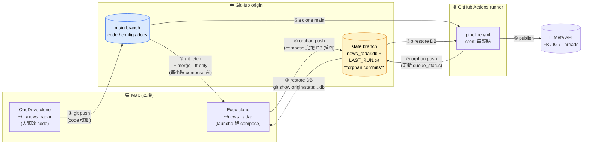

# System Architecture — News Radar SSOT (v1)

> **Scope of this doc.** `docs/architecture.md` is the canonical data-flow picture
> (Mermaid graph, Opus 4.7 pass on 2026-04-19). This doc is the **operational-reality
> companion**: where things *actually live* on disk, *when* they fire, *who* runs them,
> and *how* the Mac and Cloud stay in sync. Any time an architectural claim is
> ambiguous, this file is the ground truth; if it contradicts code, fix the code or
> the doc — no third source wins.
>
> **Last ground-truth pass:** 2026-04-22, verified against code (`src/db.py`,
> `run_pipeline.py`, `run_publish_queue.py`, `scripts/compose_hourly.sh`,
> `scripts/com.hsin.news-radar.compose.plist`), the DB itself, the installed
> launchd plist at `~/Library/LaunchAgents/`, and last 8 h of compose logs.

---

## 1. Two-clone topology

There are **two working copies** of this repo on the user's machine, and they play
different roles. Mixing them up was the root cause of the 2026-04-20 DB confusion.

| Clone | Path | Role | DB? |
|---|---|---|---|
| **OneDrive clone** (dev clone) | `~/Library/CloudStorage/OneDrive-RealtekSemiconductorCorp/文件/antigravity_workspace/substack/科技商業國際新聞自動化流程研究/news_radar` | Human edits + `git push` | Has `data/01_harvest/news_radar.db` but **nothing should run against it** — macOS TCC blocks launchd from CloudStorage |
| **Exec clone** (launchd mirror) | `/Users/hsin/news_radar` | launchd + manual compose run against **this one** | This is the authoritative runtime DB |

**Rule.** Source-of-truth for code is GitHub `main`. Source-of-truth for the
**live DB** is GitHub `state` branch. Both clones are *caches*. Specifically:

- OneDrive clone → writes code → `git push origin main`
- Exec clone → `git fetch origin main && git reset --hard origin/main` at the start of every hourly compose → runs compose → pushes DB to `state` branch
- GitHub Actions (Cloud publisher) → clones fresh → reads DB from `state` → publishes to Meta → pushes updated `state`

When these fall out of sync, the symptom is almost always "I edited file X in clone
A but the runtime is still using clone B's copy". Always ask which clone the
launchd / the script is actually reading from before debugging further.

---

## 2. Every DB instance on disk (derived from code)

All paths below were read from source, not recalled. If source changes, update
this table in the same commit.

| Symbol | Resolves to (on Hsin's Mac) | Source | Notes |
|---|---|---|---|
| `src/db.py: DB_PATH` | `/Users/hsin/news_radar/data/01_harvest/news_radar.db` | `src/db.py:19-20` — `_BASE = Path(__file__).resolve().parent.parent; DB_PATH = _BASE/"data"/"01_harvest"/"news_radar.db"` | **Anchored to code location**, immune to cwd. This is the "real" runtime DB for compose/scorer/composer/publisher. |
| `src/db.py: SCHEMA_PATH` | `/Users/hsin/news_radar/data/01_harvest/schema.sql` | `src/db.py:21` | Init-db reads this. |
| `scripts/*.py: _DB_PATH` | same as `DB_PATH` | `morning_report.py:36`, `classify_dryrun.py:44`, `queue_inspect.py:33`, `flush_legacy_drafts.py:62` all use `_ROOT/"data"/"01_harvest"/"news_radar.db"` with `_ROOT` resolved from `__file__` | Consistent with `src/db.py`. |
| `src/export_drafts.py: DB_PATH` | `/Users/hsin/news_radar/db/news_radar.db` ⚠️ **wrong path, file does not exist** | `src/export_drafts.py:11` | Bug, not currently a live footgun (script apparently unused). Park it. |
| GitHub `state` branch blob | `origin/state:data/01_harvest/news_radar.db` | `scripts/compose_hourly.sh` does `git show origin/state:data/01_harvest/news_radar.db > data/01_harvest/news_radar.db` at start of each run | This is the network-transported DB. Size as of 2026-04-22 04:30 UTC: 1,658,880 bytes. |

On disk today there is exactly **one** `news_radar.db` file under the exec clone
(verified via `find ~/news_radar -name "*.db" -not -path "*/.venv/*"`). The
OneDrive clone has its own copy but it is never written to by automation.

---

## 3. Entry-point cwd contracts

Every entry point has an implicit cwd expectation. When it holds, paths resolve
correctly; when it doesn't, something usually still "runs" but writes to the
wrong place. `src/db.py` uses `__file__`-anchored paths so it is cwd-independent,
but some sibling scripts resolve files via `pathlib.Path(...)` relative to cwd.

| Entry point | Where it's called from | Required cwd | Consequence if wrong |
|---|---|---|---|
| `run_pipeline.py` | `scripts/compose_hourly.sh` at `~/news_radar/` | `~/news_radar/` | Reads `.env` from cwd, reads `config/*`, writes `logs/`, writes `data/03_compose/pending_drafts/`. Wrong cwd → `.env` missing → Gemini key not loaded. |
| `run_publish_queue.py` | GitHub Actions `pipeline.yml` step | repo root (actions checkout) | Same concerns as above; CI sets cwd correctly. |
| `scripts/compose_one.py` | Manual: `python -m scripts.compose_one ...` | `~/news_radar/` | `compose_one.py:42-44` prepends `ROOT = Path(__file__).resolve().parents[1]` to sys.path, so import works regardless. But it still uses the `.env` in cwd. |
| `scripts/morning_report.py` | GH Actions daily; also manual | repo root | cwd-independent for DB path (via `__file__`), but other outputs depend on cwd. |
| `scripts/push_state.sh` (v1, 2026-04-22) | Manual | repo root (auto-detects by walking up for `.git`) | Auto-recovers if called from subdir; fails loudly if no repo found. |

**Pragma:** if you add a new entry point, anchor paths with `Path(__file__).resolve().parent(s)` — never raw relative paths — and put the expectation here.

---

## 4. Workflow triggers & concurrency

### 4.1 Mac end (launchd)

| Agent | Schedule | Real script at | Logs |
|---|---|---|---|
| `com.hsin.news-radar.compose` | `StartInterval 3600` (every 1 h from load time) | `~/bin/news_radar_compose.sh` (source: `scripts/compose_hourly.sh`) | `~/news_radar_snapshots/_compose_logs/YYYYMMDD_HHMMSS.log` + `/tmp/news-radar-compose.{out,err}.log` |
| `com.hsin.news-radar.snapshot` | Sunday 10:30 local | `~/bin/news_radar_weekly_snapshot.sh` | `~/news_radar_snapshots/_logs/YYYYMMDD_HHMMSS.log` |

The plists at `~/Library/LaunchAgents/com.hsin.news-radar.*.plist` are produced
from the repo's `scripts/com.hsin.news-radar.*.plist` by the `sed "s|HOME_DIR|$HOME|g"`
step in `scripts/INSTALL_COMPOSE_LAUNCHAGENT.md`. The **repo version contains
`HOME_DIR`**, the **installed version contains `/Users/hsin`**. Both are valid
plists; if they drift otherwise that's a bug.

**Important: launchd's PATH is not inherited from the login shell.** It takes
exactly what `EnvironmentVariables.PATH` says in the plist. As of 2026-04-22 that
is `HOME_DIR/.local/bin:/opt/homebrew/bin:/usr/local/bin:/usr/bin:/bin` (see
§7.2 case study for why `HOME_DIR/.local/bin` is required).

### 4.2 Cloud end (GitHub Actions)

| Workflow | Schedule | What it does |
|---|---|---|
| `pipeline.yml` | `cron: 0 * * * *` (hourly on :00) | Clone main → restore DB from `state` → `python run_publish_queue.py` → push `state` |
| `reflect_topic.yml` | `cron: 0 22 * * 0` (Sun 22:00 UTC ≈ Mon 06:00 Taipei) | Weekly topic-weight back-prop |
| `feed_healthcheck.yml` | daily | Pings feed URLs, opens GH Issue on failure |

### 4.3 Concurrency & race windows

Both the hourly compose (Mac, :30) and the hourly publish (Cloud, :00)
force-push `state` branch. They deliberately stagger by ~30 min. If their
timings cross, the later force-push overwrites the earlier — this is
**acceptable** because compose only writes new drafts and publisher only writes
updated `queue_status` / `publish_log`, and they work on disjoint rows (publish
touches drafts that compose has already finalized in previous cycles).

All Actions workflows use the same concurrency group `news-radar-pipeline` to
serialize themselves with each other. The Mac side has no such guard — it
trusts the force-push race window to be wide enough.

---

## 5. Mac ↔ Cloud sync contract

Three branches carry three kinds of state:

| Branch | Contains | Who writes | Who reads |
|---|---|---|---|
| `main` | Code, config, docs, tests | Humans (via OneDrive clone → push) | Everyone fetches this |
| `state` | `data/01_harvest/news_radar.db`, `state/last_harvest.txt`, `archive/`, `LAST_RUN.txt` | Mac `compose_hourly.sh`, Mac `push_state.sh`, Cloud `pipeline.yml`, Cloud `reflect_topic.yml` | Mac compose, Cloud publisher — **force-pushed orphan commits, no history retention** |
| `gh-pages` or none for docs | — | — | — |

### 5.1 The orphan-commit pattern

Every writer of `state` branch creates a fresh orphan commit (`git init -b state`
in a tmpdir, copy files in, commit once, force-push). This means `state` has no
git history and its commits can be overwritten freely. The writer's identity is
recorded in `LAST_RUN.txt` (kind, UTC timestamp, host, optionally DB hash).

**Why orphan:** history would balloon the repo (DB is ~1.6 MB, changes every
hour, so 24×365 = 8.7k commits/year). Orphan keeps repo size flat.

### 5.2 What `push_state.sh` adds (new, 2026-04-22)

`scripts/push_state.sh` is a manual-triggered variant of the state-branch push
logic in `compose_hourly.sh`, with two additions that close the 2026-04-20 hole:

1. **sha256 post-condition.** After push, it re-fetches `origin/state`, extracts
   the DB, and asserts the remote blob's sha256 matches local. If not, exit 1.
2. **Optional `--expect-draft <id>`.** Pre-push, SQL-assert the id exists locally;
   post-push, SQL-assert the id exists in the re-fetched DB. This is the
   "I pushed a queued draft and need to confirm it landed" workflow.

Anything that writes a draft and then claims "it's queued" should pipe through
`push_state.sh --expect-draft <new_id>` or equivalent — log lines alone are not
evidence.

### 5.3 Hybrid 三方同步視覺圖（Mac × Cloud × GitHub）

§5 的表格用 prose 講完了誰讀誰寫，這裡補一張可以 30 秒看懂的視覺版。
三個實體、兩條分支、五條 recurring 路徑。



**分工規則（記三條就夠）**：

1. **`main` 分支 = 程式碼／設定／文件**：只有人類會寫（從 OneDrive clone push）。Exec clone 跟 Cloud runner 都只讀。
2. **`state` 分支 = 執行狀態（DB + LAST_RUN.txt）**：Exec clone 跟 Cloud runner 都會寫，都是 **orphan force-push**（無歷史，只保留最新一份）。
3. **OneDrive clone 不跑 launchd**（macOS TCC 會擋 CloudStorage 的背景寫入），Exec clone 也 **不手動改 code**（launchd 每小時 `git reset --hard` 會擦掉）。

**為什麼是 `--ff-only`（Phase 8.20 後）而不是 `git reset --hard`**：
`--ff-only` 只允許「純粹向前」的更新；如果 Exec clone 意外有了本地 commit（例如某次 debug 手癢在 Exec clone 改了東西），merge 會拒絕並報錯，讓你來人工處理。`reset --hard` 則會無聲蓋掉——曾經發生過一次本地 hotfix 被清掉的事故。

---

## 6. Queue state machine

Reading `drafts` table columns `status` + `queue_status`:

| `status` | `queue_status` | Meaning |
|---|---|---|
| `pending_review` | `NULL` | Scorer said ≥0.65 but <0.9 — composed, not auto-publishable, not queued |
| `auto_approved` | `NULL` | Just composed, waiting to be enqueued (transient; compose should set queue_status in the same transaction) |
| `auto_approved` | `queued` | Ready for Cloud publisher to pick |
| `auto_approved` | `published` | Cloud publisher succeeded on ≥1 platform |
| `auto_approved` | `failed` | Guard blocked / Cloud publisher all-platforms-failed |
| `auto_approved` | `stale` | An older queued draft superseded by a fresher one |
| `published` | `published` | Legacy / post-hoc consistency state |

**Current DB snapshot (2026-04-22 06:00 UTC):**

```
status='auto_approved'  qs='failed'      n=18
status='pending_review' qs='failed'      n=12
status='pending_review' qs=NULL          n=3    ← 2026-04-20 15:59–16:07 drafts
status='published'      qs='published'   n=1
(zero queued)
```

The three `qs=NULL` rows from 2026-04-20 are the **last real composer outputs
on this system**. Everything since then is no-ops due to §7.1. Nothing is
eligible for today's publish without either new compose or manual promotion.

---

## 7. Case studies — failures that forced doc updates

### 7.1 Gemini 429 × Claude CLI not-in-PATH = silent pipeline stall

**Symptom (2026-04-20 evening onward):** Hourly compose appears to run. Every log
ends with `pipeline exit code: 0` and `state branch 已更新`. But `drafts` table
stops receiving new rows after 2026-04-20T16:07. Publisher queue goes empty and
stays empty.

**Root cause** (verified 2026-04-22 from `~/news_radar_snapshots/_compose_logs/20260422_*.log`):

1. Gemini free tier quota is 20 req/day on `gemini-3-flash` (as of April 2026).
   User's `.env` key burned through daily by hourly composes + morning_report +
   reflect_topic. Every hour from somewhere around daily reset, scorer hits 429.
2. `src/llm_brain.py:146-150` defines `_claude_cli_available()` as
   `shutil.which(CLAUDE_CLI_BIN) is not None`.
3. launchd's plist PATH was `/opt/homebrew/bin:/usr/local/bin:/usr/bin:/bin`.
   Claude CLI is installed via the native installer at
   `/Users/hsin/.local/bin/claude` (symlink → `/Users/hsin/.local/share/claude/versions/<v>`),
   which is **not** in that PATH. So `which` returned None, Claude fallback path
   never activated.
4. Scorer falls through to `return None` → `process_item` returns
   `"skipped_no_llm"` → no draft written → commit is empty → state branch
   push happens but the DB is unchanged (LAST_RUN.txt bumps prevent "no commit"
   skip, so the push appears to succeed).
5. Hunter loop scans 8 items, all skip, loop terminates cleanly — the
   `pipeline exit code: 0` comes from a well-behaved skip, not from successful
   work.

This is also the origin of the "compose_one reported qs=queued but DB empty"
handoff report on the morning of 2026-04-22: the prior agent read "queued" in
the log out of context, but `process_item` almost certainly returned
`skipped_no_llm`. Final verification would require the terminal scrollback
from that run, which has been lost; hypothesis stands.

**Fix (applied 2026-04-22):** Update plist PATH to include `HOME_DIR/.local/bin`
(see `scripts/com.hsin.news-radar.compose.plist`; installed version at
`~/Library/LaunchAgents/` same but with `/Users/hsin/`). After user runs
`launchctl unload/load`, the next hourly compose will have `claude` on PATH
and the Phase 8.19 fallback will activate when Gemini 429s.

**Detection going forward:** `scripts/morning_report.py` should include a
"LLM path health" section — count of `skipped_no_llm` returns in the last 24 h.
If every cycle skipped → page. (Noted as follow-up; not implemented in this
session.)

### 7.2 Launchd minimal PATH trap

The generalization of §7.1: **launchd does not inherit the login shell's
PATH**. If a binary is installed under `~/.local/bin`, `~/.npm-global/bin`,
`~/.volta/bin`, nvm, mise, conda, or any other user-level prefix, it must be
explicitly listed in `EnvironmentVariables.PATH` inside the plist (or the
script must hard-code the absolute path). Don't assume that "works in my
terminal" means "works under launchd".

**Smoke test before deploying any plist change:**

```bash
# Simulate launchd's PATH, check the binary you depend on
env -i PATH='<same string as plist>' your_binary --version
```

If that fails, launchd will fail too.

### 7.3 "Log says ✅ so it worked" — post-condition mandate

Multiple recent bugs (2026-04-20 DB confusion, §7.1 silent stall, prior
emergency-template pollution) share a shape: a shell / Python pipeline prints
a success line that is not backed by a SELECT / assert on the actual state
change. From 2026-04-22 on:

- **Every DB write that is intended to be persistent** must be followed by a
  SELECT that asserts the expected row exists, and the assertion result (not
  a log line about the intent) is what determines success.
- **Every state-branch push** must be followed by a fetch + sha256 compare
  (see `push_state.sh` §5.2). `compose_hourly.sh` still uses the log-line
  pattern for now — that's acceptable because the force-push semantics make
  silent loss cheap to recover from, but anything manual or high-stakes
  should use `push_state.sh`.
- **Compose_one's own result log** (`[ComposeOne] ✅ DB 最新 draft: …`) already
  does this right — it queries back after `conn.commit()` and only prints ✅ if
  the new row exists. Pattern to copy.

---

## 8. What the skills enforce

Three user-level skills (installed under `news_radar/.claude/skills/` per repo
decision, 2026-04-22) bind the above disciplines into the agent workflow:

- **`project-spec`** — forces any Claude session on this repo to read this
  file (§ System Architecture) before making architectural claims, and to
  write back any newly-discovered ground truth into this file before closing
  out.
- **`scoped-vdd`** — before editing any module, the agent must write a scope
  declaration + explicit edge cases + explicit post-condition, *then* edit.
  No "read-code-and-edit-at-same-time" fluency; the post-condition clause is
  what links log output to reality (§7.3).
- **`cto`** — meta-process rules: log cadence (one checkpoint per completed
  unit), multi-clone sync protocol (if editing code, it's the OneDrive clone;
  if editing runtime state, it's the exec clone), red-line definitions
  (`git push`, `rm` of data, large API bursts, anything touching PII).

See `news_radar/.claude/skills/<name>/SKILL.md` for the full definitions.

---

## 9. Open items not yet in code

- `scripts/morning_report.py` should count `skipped_no_llm` returns in last
  24 h and flag if every compose cycle skipped (§7.1 detection clause).
- `src/export_drafts.py:11` still has the wrong DB path (`db/news_radar.db`).
  Not currently breaking anything — script unused. Park until first use.
- `compose_hourly.sh` prints `✅ state branch 已更新` without fetching back to
  verify. Low-priority since force-push semantics make silent loss cheap to
  recover from, but would be a good hardening.
- The Gemini free-tier cap (20/day) is structurally insufficient for the
  current workload. Either upgrade the plan, or accept the cap and tune
  compose frequency down. Either way, once §7.1's fix is live, Claude CLI
  fallback should keep the pipeline running through Gemini outages.

---

## Appendix — Ground-truth commands

If in doubt, re-run these (they are cheap and read-only):

```bash
# Where is every DB_PATH defined?
grep -rn "DB_PATH\s*=" ~/news_radar/src ~/news_radar/scripts ~/news_radar/run_*.py

# What DB files actually exist?
find ~/news_radar/ -name "*.db" -not -path "*/.venv/*" -not -path "*/__pycache__/*"

# What's on the state branch right now?
cd ~/news_radar && git fetch origin state && git show origin/state:LAST_RUN.txt

# Launchd PATH vs reality
plutil -extract EnvironmentVariables.PATH xml1 -o - \
    ~/Library/LaunchAgents/com.hsin.news-radar.compose.plist
env -i PATH=$(plutil -extract EnvironmentVariables.PATH raw -o - \
    ~/Library/LaunchAgents/com.hsin.news-radar.compose.plist) which claude

# Are any drafts actually queued right now?
python3 -c "import sqlite3; c=sqlite3.connect('$HOME/news_radar/data/01_harvest/news_radar.db'); \
print(list(c.execute(\"SELECT queue_status, COUNT(*) FROM drafts GROUP BY queue_status\")))"
```

Any disagreement between these outputs and this document means the document is
stale and should be updated *in the same commit* that makes the code change.
