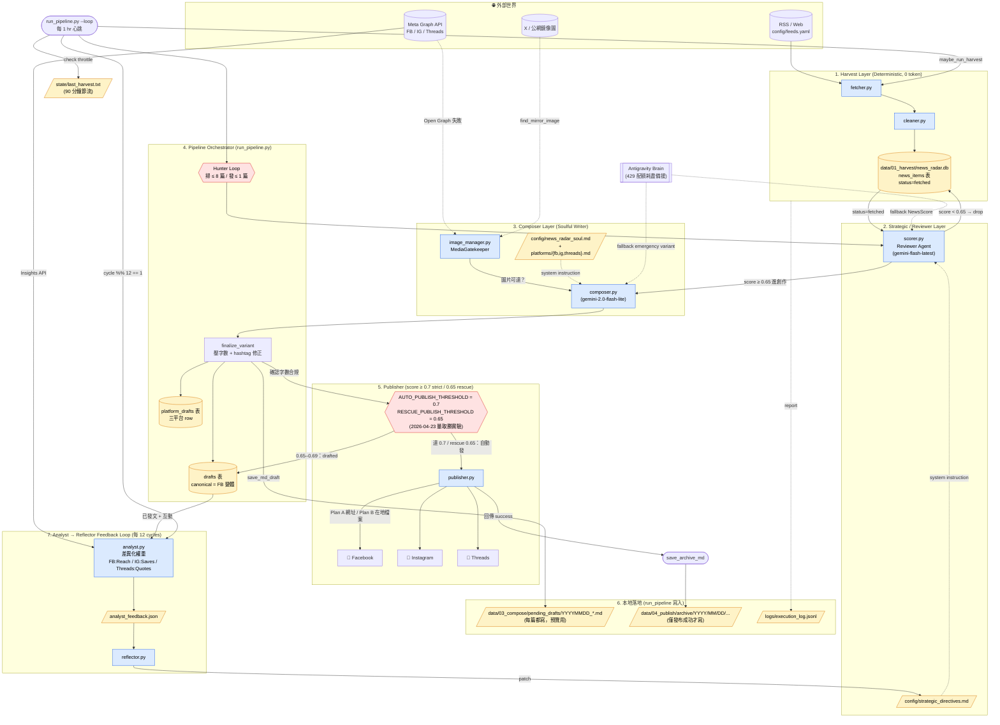

# News Radar 系統架構圖 (System Architecture)

> 2026-04-19 由 Claude Opus 4.7 對 Gemini 原版 (見文末「歷史版本錯誤對照」) 全面校對重繪。
> 本圖為「程式碼 ground-truth」版本，所有箭頭與節點名稱皆與 `src/` 實際實作對齊。

---

## 🗺️ 完整資料流（含 Hunter Loop / Archive / Feedback Loop）



---

## 🛠️ 模組與檔案速查

| 階段 | 主要程式 | 落地產物 | Token 成本 |
|---|---|---|---|
| 1. Harvest | `run_harvest.py` / `src/fetcher.py` / `src/cleaner.py` | `news_items` 表、`logs/execution_log.jsonl` | 0 |
| 2. Score | `src/scorer.py` (Gemini Flash 8B) | 寫回 `news_items.score`、`editorial_note` | 極低 (~200 tok in / ~120 out) |
| 3. Compose | `src/composer.py` (Gemini 2.0 Flash-Lite) | `MultiPlatformDraft` (fb/ig/threads) | 中 (~3K in / ~1K out 一次三平台) |
| 4. Finalize | `run_pipeline.finalize_variant` + `_squeeze_to_limit` | `platform_drafts`、`drafts` 表、`data/03_compose/pending_drafts/*.md` | 0 |
| 5. Publish | `src/publisher.py` (Meta Graph API) | `publish_log` 表 + 平台貼文 | 0 |
| 6. Archive | `run_pipeline.save_archive_md` | `data/04_publish/archive/YYYY/MM/DD/...` | 0 |
| 7. Feedback | `src/analyst.py` + `src/reflector.py` | `analyst_feedback.json`、改寫 `strategic_directives.md` | 中 (每 6 hr 一次) |

---

## 🚦 三道關卡與兩個門檻

```
score < 0.65       →  dropped (不寫稿、不發、不浪費 token)
0.65 ≤ s < 0.7     →  drafted (產三平台稿，落 pending_drafts/；rescue 時段會被自動拾取發文)
score ≥ 0.7        →  published (嚴格模式，發文距上次 1–2hr 時用此門檻)
score ≥ 0.65       →  published (rescue 模式，距上次 ≥ 2hr 避免空窗用此門檻；等於全發)
```

> 門檻歷史：
> - 2026-04-22 以前：0.9 / 0.8（嚴選，實測 queue 長期空置）
> - 2026-04-23 起：**0.7 / 0.65（量取勝 2 週實驗）**。近乎全開，只受 1hr 最小間隔與 1/slot 節流。
>   兩週後由 analyst 的互動數據（FB reach、IG saves、Threads quotes）決定是否回升。


**Hunter Loop 終止條件（兩個之一觸發即停）**：
- 已發 `MAX_PUBLISH_PER_SLOT (= 1)` 篇
- 已掃 `MAX_POSTS_PER_SLOT (= 8)` 篇仍未獵殺成功

---

## 🩹 歷史版本錯誤對照（Gemini 原版的問題）

| # | Gemini 原圖內容 | 實際程式 | 修正 |
|---|---|---|---|
| 1 | `archives/` 資料夾 | 程式寫的是 `archive/`（單數） | 改為 `archive/YYYY/MM/DD/...` 並標明日期樹狀 |
| 2 | `PUB -.->\|持久化\| ARC` | publisher.py 不寫 archive，落地是 `run_pipeline.save_archive_md` 在 publish 成功後執行 | 拉一條 `PUB → ARCHIVE_HOOK(save_archive_md) → archive/` |
| 3 | `SC -->\|0.9+ 轉交\| CP` | 實際門檻是 `MIN_SCORE_THRESHOLD = 0.65` 才轉交 composer；`AUTO_PUBLISH_THRESHOLD = 0.9` 是「決定要不要呼叫 publisher」的門檻，發生在 composer 之後 | 拆成兩道：`score≥0.65 進 composer` + `score≥0.9 進 publisher` |
| 4 | `LP -->\|驅動\| 1.` 等指向 `1.` `2.` `3.` 字面 | mermaid 會把這些當作獨立節點 id 建空節點，並非真的指向 subgraph | 改為精確指向 subgraph 內具體節點（`LOOP → FH`、`LOOP → HUNT`、`LOOP → AL`） |
| 5 | 缺少 `state/last_harvest.txt` | 已存在的 90 分鐘節流檔 | 補上節點與 `LOOP -- check throttle --> STATE` |
| 6 | 缺少 `analyst_feedback.json` | analyst 確實會輸出此 JSON 給 reflector | 補上節點 `AL → AF → RF` |
| 7 | 缺少 `platform_drafts` 與 `drafts` 兩張表的區別 | 兩張表角色不同：drafts=canonical(FB)，platform_drafts=三平台變體 | 兩張表都畫出來 |
| 8 | Hunter Algorithm 只在備註提到 | Hunter 是 main loop 的核心終止邏輯（≤ 8 / ≤ 1） | 拉成 `HUNT` 節點，標明上下限 |
| 9 | 缺少 `drafts/` vs. `archive/` 區別 | 兩者寫入時機不同（前者每篇寫，後者僅發布成功才寫） | 兩者並列，註明寫入時機 |
| 10 | 沒有顯示「圖片鏡像備援」 | `image_manager.find_mirror_image` 確實存在 | 補上 `MIRROR -. find_mirror_image .-> IM` |

---

## 📌 待補（後續 Milestone 候選）

- 將 Reflector 的回饋擴展到 **`config/feeds.yaml`**，讓「冷飯來源」可被自動降權（目前回饋僅影響 prompt）。
- `analyst.py` 加入跨平台 KPI normalization，讓三平台分數可以加權比較。
- 引入「相似標題去重」（已有 `list_recent_titles`，但 scorer 尚未呼叫）。
