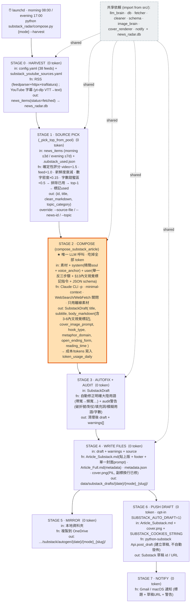

# substack_radar · Pipeline Block Diagram

> AI-readable single source of truth for the twice-daily Substack draft pipeline.
> Two representations below: (1) a Mermaid flowchart (renders in GitHub/IDE), and
> (2) a machine-readable stage I/O contract (YAML). Keep both in sync with the code.
> Entry point: `python substack_radar/compose.py {morning|evening} --harvest`.
> **Only STAGE 2 consumes LLM tokens; every other stage is deterministic (0 token).**

## Mermaid flowchart



## Machine-readable stage contract

```yaml
pipeline: substack_radar
entrypoint: "python substack_radar/compose.py {morning|evening} --harvest"
schedule: { morning: "08:00", evening: "17:00", via: launchd }
token_stages: [stage_2_compose]   # everything else is deterministic / 0 token
stages:
  - id: 0_harvest
    impl: substack_radar/harvest_inspiration.py (+ src/fetcher.py, substack_radar/youtube_transcripts.py)
    token: 0
    input:  ["config.yaml feeds(38)", "substack_youtube_sources.yaml"]
    function: "RSS fetch+clean (trafilatura) ; YouTube transcripts (yt-dlp VTT→text)"
    output: ["news_items rows status=fetched in news_radar.db"]
  - id: 1_source_pick
    impl: "substack_radar/compose.py::_pick_top_from_pool"
    token: 0
    input:  ["news_items (morning≤3d / evening≤7d)", ".substack_used.json"]
    function: "deterministic score (video+1.5, inspiration-feed+1.0, freshness decay, signal-density*0.15, wordcount sweet-spot+0.5); exclude used; top-1; mark used"
    output: ["(id, title, clean_markdown, topic_category)"]
    overrides: ["--source-file", "--news-id", "--topic"]
  - id: 2_compose
    impl: "substack_radar/composer.py::compose_substack_article → src/llm_brain.py::call_for_json (Claude CLI)"
    token: ALL          # the entire token budget of the pipeline
    input:  ["picked source text", "system = trimmed soul + voice_anchor", "user = mode hint + 舉一反三 step + §13 inline-image marker spec + JSON schema"]
    function: "Claude CLI -p, minimal-context flags, WebSearch/WebFetch disabled, writes from supplied material only"
    output: ["SubstackDraft{title, subtitle, body_markdown(with 3-6 inline image markers), cover_image_prompt, hook_type, metaphor_domain_used, open_ending_form, reading_time_minutes}", "usage → token_usage_daily"]
  - id: 3_autofix_audit
    impl: "substack_radar/composer.py::autofix_mainland_terms + audit_substack_draft"
    token: 0
    input:  ["SubstackDraft"]
    function: "auto-replace unambiguous mainland terms; warn on dash/parallelism/filler/ambiguous-terms/wordcount"
    output: ["cleaned draft", "warnings[]"]
  - id: 4_write_files
    impl: "substack_radar/compose.py::write_* + render_substack_cover"
    token: 0
    input:  ["draft", "warnings", "source"]
    function: "Article_Substack.md(paste-ready + footer + ONE cover prompt); Article_Full.md(metadata); metadata.json; cover.png(PIL, wrapped subtitle)"
    output: ["data/substack_drafts/{date}/{mode}_{slug}/"]
  - id: 5_mirror
    impl: "substack_radar/compose.py::mirror_to_onedrive"
    token: 0
    input:  ["local draft folder"]
    function: "copy folder to OneDrive"
    output: [".../substack/autogen/{date}/{mode}_{slug}/"]
  - id: 6_push_draft
    impl: "substack_radar/compose.py::push_to_substack_draft (python-substack)"
    token: 0
    opt_in: "SUBSTACK_AUTO_DRAFT=1 + SUBSTACK_COOKIES_STRING + SUBSTACK_PUBLICATION_URL"
    input:  ["Article_Substack.md", "cover.png", "cookies"]
    function: "Api.post_draft — creates a DRAFT (never auto-publishes)"
    output: ["Substack draft id / URL"]
  - id: 7_notify
    impl: "src/notify.py"
    token: 0
    function: "Gmail / macOS notification (title + draft URL + audit warnings)"
shared_deps:
  note: "substack_radar imports these from src/ via repo-root on sys.path (NOT symlinked, to avoid double-import)"
  modules: [llm_brain, db, fetcher, cleaner, schema, image_brain, cover_renderer, notify]
  data: [news_radar.db]
naming_note: "package is 'substack_radar' NOT 'substack' — a local 'substack' package would shadow the pip python-substack library (from substack import Api) and break Stage 6."
```
