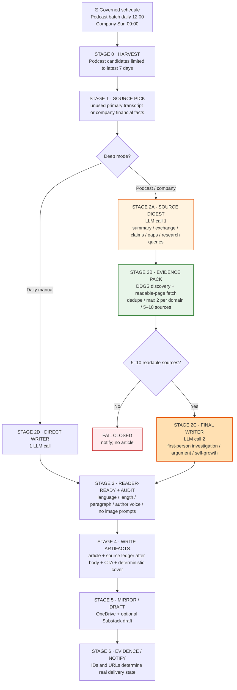

# substack_radar · Pipeline Block Diagram

> AI-readable source of truth for the noon two-draft Podcast batch and Sunday
> company analysis. Entry point:
> `python substack_radar/compose.py {morning|evening|podcast|company}`.
> Podcast/company use two LLM calls separated by a deterministic evidence gate;
> Daily manual modes retain the direct writer path.

## Mermaid flowchart



## Machine-readable stage contract

```yaml
pipeline: substack_radar
entrypoint: "python substack_radar/compose.py {morning|evening|podcast|company}"
schedule:
  podcast_batch: "daily 12:00, two sequential drafts, candidates <=7d"
  weekly_company: "Sun 09:00, pick then compose in one job"
writer_chain: [codex_cli, claude_cli]
deep_profiles:
  podcast: { chars: [4200, 6500], reading_minutes: "17-25", sources: [5, 10] }
  company: { chars: [3800, 6000], reading_minutes: "15-23", sources: [5, 10] }
daily_profile: { chars: [1800, 2800], reading_minutes: "7-10" }
stages:
  - id: 0_harvest
    token: 0
    output: "news_items(status=fetched); Podcast pool contains only current candidates"
  - id: 1_source_pick
    token: 0
    function: "exclude used; score; select one primary source"
  - id: 2a_source_digest
    applies_to: [podcast, company]
    token: LLM
    impl: "composer.py::plan_editorial_research"
    web_tools: disabled
    output: "EditorialResearchBrief"
  - id: 2b_evidence_pack
    applies_to: [podcast, company]
    token: 0
    impl: "editorial_research.py::build_research_pack"
    function: "search, fetch readable body, reject snippet-only, dedupe, cap domain concentration"
    invariant: "5 <= usable extension sources <= 10; primary source excluded"
    error: "fail closed and notify"
  - id: 2c_final_writer
    applies_to: [podcast, company]
    token: LLM
    impl: "composer.py::compose_substack_article"
    input: ["source digest", "validated evidence pack", "article-form contract"]
    web_tools: disabled
    output: "SubstackDraft{title, subtitle, body_markdown}"
  - id: 2d_direct_writer
    applies_to: [morning, evening]
    token: LLM
    output: "SubstackDraft{title, subtitle, body_markdown}"
  - id: 3_reader_ready_audit
    token: 0
    function: "strip production instructions; Taiwan language fixes; warn on length, paragraph, first-person voice and reply question"
  - id: 4_write_files
    token: 0
    output: ["Article_Substack.md", "Article_Full.md", "metadata.json", "cover.png"]
    presentation: "provenance at top; article; complete source ledger; subscription CTA"
  - id: 5_remote_draft
    token: 0
    opt_in: "SUBSTACK_AUTO_DRAFT=1 + valid cookies/publication URL"
    proof: "remote draft id; public URL readback only for explicit publish-now"
```

## Proof boundary

- Unit tests prove prompt/schema/gating behavior, not prose quality.
- A live DDGS/page-fetch smoke test proves this host can build one evidence pack,
  not that tomorrow's topic will find five good sources.
- Repository configuration is not schedule execution or a remote Substack draft.
